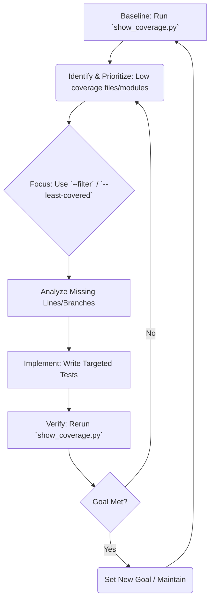

# Strategy: Improving Test Coverage using `show_coverage.py`

This document outlines a systematic approach to using the `rna_predict/scripts/show_coverage.py` script for assessing and enhancing test coverage within the `RNA_PREDICT` codebase.

**Prerequisites:**

*   Ensure all test dependencies are installed: `pip install -r requirements-test.txt`
*   **Note:** The script uses `pytest-memprof` flags. Verify that the `pytest-memprof` plugin is installed. If not, install it (`pip install pytest-memprof`).

**1. Running the `show_coverage.py` Script**

The script serves as a wrapper around `pytest --cov` and `coverage report`. Execute it from the project root directory (`/Users/tomriddle1/RNA_PREDICT`).

*   **Baseline / Full Report:** Get the overall coverage picture.
    ```bash
    python rna_predict/scripts/show_coverage.py
    ```
    This runs all tests, combines coverage data, and displays the standard `coverage report -m` output, including missing line numbers and branch coverage details, plus a memory usage summary.

*   **Filtered Report:** Focus on specific modules or sub-packages using a path pattern.
    ```bash
    # Example: Show coverage only for files within the stageA pipeline
    python rna_predict/scripts/show_coverage.py --filter rna_predict/pipeline/stageA

    # Example: Show coverage for utility functions
    python rna_predict/scripts/show_coverage.py --filter rna_predict/utils
    ```
    This helps narrow down investigation to specific areas.

*   **Least Covered Report:** Quickly identify the single file with the lowest coverage percentage (ignoring files with 0 statements) and see its untested lines directly.
    ```bash
    python rna_predict/scripts/show_coverage.py --least-covered
    ```
    This is useful for pinpointing the most critical area needing immediate attention.

**2. Interpreting Script Outputs**

Understanding the reports is key to taking action.

*   **Full/Filtered Report (`coverage report -m` format):**
    *   `Name`: The path to the source file.
    *   `Stmts`: Total number of executable statements in the file.
    *   `Miss`: Number of statements *not* executed by any test.
    *   `Branch`: Total number of possible execution branches (e.g., each side of an `if`/`else`).
    *   `BrPart`: Number of branch paths *not* taken by any test (Branch Partial).
    *   `Cover`: Overall statement coverage percentage (`100 * (Stmts - Miss) / Stmts`). Branch coverage is implicitly included via `BrPart`. A line is only fully covered if all its branches are taken.
    *   `Missing`: Specific line numbers or ranges of statements not executed. Also shows partial branches (e.g., `35->37` means the branch from line 35 *to* line 37 was never taken).

*   **`--least-covered` Report:**
    *   Displays the standard report line for the single file with the lowest `Cover %`.
    *   Prints the `File with lowest coverage`, `Coverage %`, and raw `Missing lines` string.
    *   Crucially, it then reads the source file and prints the actual code for each `Untested line`, prefixed by its line number. This provides immediate context for writing new tests.

*   **Memory Usage Summary:**
    *   Lists the top 10 tests consuming the most memory (as reported by `pytest-memprof`). Useful for identifying potentially inefficient tests, but separate from code coverage analysis.

**3. Systematic Process for Identifying Coverage Gaps**

Use the script outputs strategically:

1.  **Establish Baseline:** Run the full report (`python rna_predict/scripts/show_coverage.py`) to understand the current overall coverage percentage and identify modules/files with low scores (e.g., below a target like 80% or 90%).
2.  **Prioritize:** Focus efforts based on:
    *   **Lowest Coverage:** Files identified by `--least-covered` or those at the bottom of the full report.
    *   **Criticality:** Core logic, complex algorithms (e.g., pipeline stages, key utils), or frequently modified modules are higher priority than simple scripts or peripheral code.
    *   **High `Miss` / `BrPart` Count:** Files with many missed statements or branches indicate significant untested logic.
3.  **Investigate:**
    *   Use `--filter` to drill down into specific low-coverage modules identified in the baseline report.
    *   Use `--least-covered` repeatedly. After fixing the lowest, rerun to find the *next* lowest.
4.  **Analyze Missing Lines:** For prioritized files, examine the `Missing` column (full/filtered report) or the `Untested lines` output (`--least-covered`) to understand *exactly* what code paths are not being tested.

**4. Translating Missing Lines to Targeted Tests**

The `Missing` lines/branches directly guide test creation:

*   **Missing Statement Line (e.g., `Missing: 42`):** The code on line 42 was never executed. Write a test case whose execution path includes line 42.
*   **Missing Range (e.g., `Missing: 50-55`):** Lines 50 through 55 were not executed. This often happens inside conditional blocks (`if`, `elif`, `else`) or loops that weren't entered. Write tests that satisfy the conditions to enter that block/loop.
*   **Missing Line in `except` Block (e.g., `Missing: 65` where line 65 is `print("Error")` inside `except ValueError:`):** The `ValueError` was never triggered. Write a test that specifically causes a `ValueError` in the `try` block.
*   **Missing Branch (e.g., `Missing: 30->32`):** The condition on line 30 evaluated such that execution *did not* proceed directly to line 32 (it likely went to an `else` or jumped past the block). Write a test where the condition on line 30 *does* lead to line 32. Conversely, if `Missing: 30->exit` appears, it means the condition on line 30 *always* evaluated the same way, never taking the other path.
*   **`--least-covered` Untested Lines Output:** This makes it even easier. Look at the printed code snippet for line `N`. Determine what input or state is needed for that line to be executed, and create a test case for it.

**Example:**
If `--least-covered` shows:
```
File with lowest coverage: rna_predict/pipeline/stageC/mp_nerf/utils.py
Coverage: 65%
Missing lines: 88-92, 105->107

Untested lines:
  88 |     if not data:
  89 |         logger.warning("Received empty data.")
  90 |         return None
  91 |     # ... more processing
  92 |     result = process(data)
 ...
 105 |     if config.get("use_fallback"):
 ...
```
This tells you:
*   Need a test for `utils.py` where the input `data` is empty or `None` (to cover lines 88-90).
*   Need a test where `data` is *not* empty (to cover line 92 and potentially subsequent lines).
*   Need a test where `config.get("use_fallback")` is `True` (to cover the branch *into* line 107, assuming line 105 is the `if` statement).

**5. Iterative Workflow for Coverage Improvement**

Adopt a cyclical approach:



1.  **Baseline:** Run the script, note the overall percentage and key low points.
2.  **Target:** Set a specific, achievable goal (e.g., "Increase overall coverage by 5%", "Ensure `rna_predict/utils/` reaches 90%", "Eliminate missing lines in `least-covered` file").
3.  **Implement:** Write the necessary tests based on the analysis (Step 4). Focus on the prioritized areas.
4.  **Verify:** Rerun the script (`show_coverage.py` with appropriate flags) to confirm the new tests cover the intended lines/branches and that the coverage percentage has increased. Check for any unexpected decreases elsewhere (regressions).
5.  **Repeat:** Continue the cycle, iteratively improving coverage.
6.  **Maintain:** Once a satisfactory level is reached, monitor coverage regularly. Consider integrating a coverage check into CI/CD pipelines, potentially by setting a `fail_under` threshold in `.coveragerc` in the future.