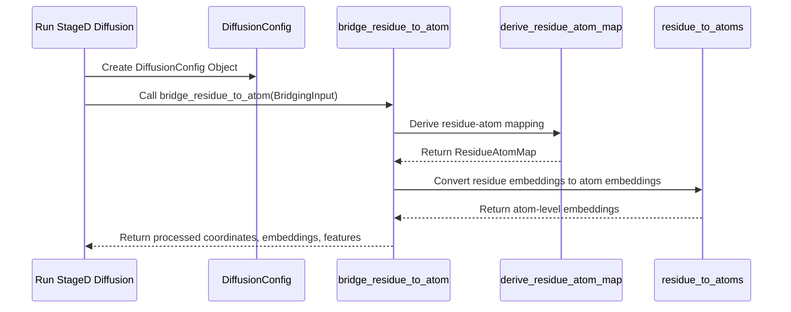
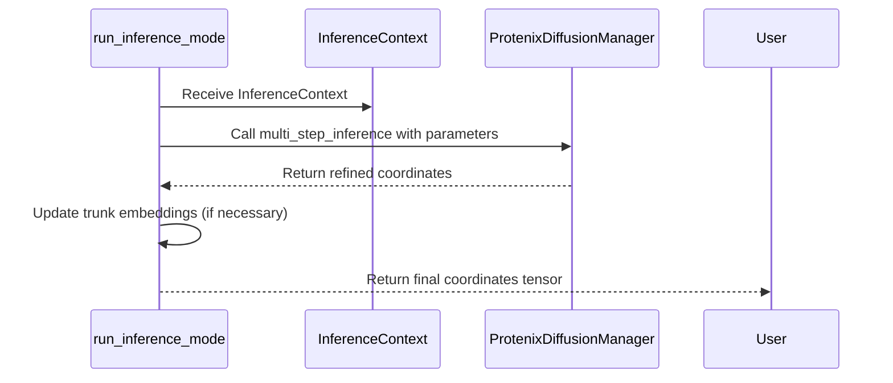

# Pull Request #46: Unify Residue and Atom Representation

## Status
- State: MERGED
- Created: 2025-04-12
- Updated: 2025-04-12
- Closed: 2025-04-12
- Merged: 2025-04-12

## Changes
- Additions: 6892
- Deletions: 372
- Changed Files: 48

## Author
- Name: ImmortalDemonGod
- Login: ImmortalDemonGod
- Bot: No

## Assignees
- None

## Description
## Description
This PR implements a unified approach for handling residue and atom-level representations in the RNA prediction pipeline. It introduces a bridging mechanism that allows Stage B (which operates at residue level) to seamlessly connect with Stage D (which requires atom level), with proper handling of tensor dimensions and shape transformations.

## Key Changes

### Core Bridging Implementation
- Added residue-to-atom bridging functionality in `rna_predict/pipeline/stageD/diffusion/bridging/`
- Implemented sequence utilities for consistent handling of RNA sequences

### Tensor Utilities
- Created comprehensive tensor utilities for dimension handling and shape transformations
- Added validation, embedding, and residue mapping utilities

### Diffusion Modules
- Updated diffusion training and inference modules for residue-atom compatibility
- Added configuration types and utilities for the bridging mechanism

### Pipeline Integration
- Refactored existing pipeline files to use the new bridging approach
- Updated tensor fixes to work with the unified representation

### Testing
- Added comprehensive test suite for all new components
- Ensured backward compatibility with existing tests

### Documentation
- Added detailed documentation explaining the bridging approach
- Included implementation notes, design specs, and guidelines

## Coverage Configuration
- Added phased test coverage targets with different requirements for critical, standard, and utility modules

## Testing Done
- All tests pass with the new implementation
- Verified that the pipeline produces the same results with the unified approach

Resolves task #12

---
Pull Request opened by [Augment Code](https://www.augmentcode.com/) with guidance from the PR author

## Summary by CodeRabbit

- **New Features**
  - Introduced a configuration framework to monitor project coverage metrics.
  - Enhanced RNA prediction by implementing a systematic bridging mechanism that refines the conversion between different molecular representations.
- **Documentation**
  - Added comprehensive design guidelines and usage notes to clarify the new bridging approach.
- **Refactor**
  - Streamlined configuration management in the diffusion process for improved clarity and robustness.
- **Tests**
  - Expanded automated testing to ensure reliability and performance across the pipeline.

## Comments

### Comment by coderabbitai
- Created: 2025-04-12
- Author Association: NONE

## Walkthrough

The pull request adds a new coverage configuration file and introduces a comprehensive residue‐to‐atom bridging mechanism within the RNA prediction pipeline. New modules and functions are created for mapping residue embeddings to atom embeddings, with updated documentation, design specifications, and refactoring plans. Inference, training, and tensor utility functions are enhanced via new configuration types (e.g. DiffusionConfig) and supporting utilities. Additionally, the changes include extensive test suites covering bridging, tensor utilities, pipeline execution, and performance, along with minor legacy refactoring for readability and maintainability.

## Changes

| **File(s)** | **Change Summary** |
|-------------|--------------------|
| `.coverage_config.json``docs/pipeline/residue_atom_bridging/*.md` | Introduced a new configuration file outlining coverage metrics; added audit reports, guidelines, design specs, documentation drafts, implementation notes, and a refactoring plan for residue-to-atom bridging. |
| `rna_predict/pipeline/stageD/diffusion/bridging/**``rna_predict/pipeline/stageD/run_stageD.py``rna_predict/pipeline/stageD/diffusion/run_stageD_unified.py` | Added new bridging modules and functions (e.g. `bridge_residue_to_atom`, `BridgingInput`) to replace ad-hoc shape validation; updated pipeline flow to use a unified `DiffusionConfig`. |
| `rna_predict/pipeline/stageD/diffusion/inference/**``rna_predict/pipeline/stageD/diffusion/training/**``rna_predict/pipeline/stageD/diffusion/utils/**` | Introduced new inference (`run_inference_mode`, `InferenceContext`) and training (`run_training_mode`, `TrainingContext`) modules; added utilities for configuration management, tensor normalization, and embedding handling. |
| `rna_predict/utils/tensor_utils.py``rna_predict/utils/tensor_utils/*` | Created a new tensor utilities package with submodules for residue mapping, embedding conversion, type definitions (`ResidueAtomMap`, `STANDARD_RNA_ATOMS`), and validation to support the bridging functionality. |
| `tests/**` | Added extensive, comprehensive test suites covering bridging, tensor utilities, inference, training, performance, and pipeline modules; updated tests to adopt the new configuration and bridging methods. |
| `rna_predict/pipeline/stageD/tensor_fixes/__init__.py` | Reformatted function signatures for readability; removed the legacy `fix_atom_attention_encoder` function; performed additional minor refactoring for clarity. |

## Sequence Diagram(s)

## Poem

> I’m a rabbit hopping through code fields so wide,  
> Bridging residues to atoms with a joyful stride.  
> New configs and docs make the structure shine bright,  
> Tests and refactors give our pipeline its might.  
> With every line of Python, my whiskers twitch with glee,  
> Carrots and code unite—what a delightful spree!  
> Hoppy changes abound in our RNA symphony.

> [!TIP]
> 
> ⚡💬 Agentic Chat (Pro Plan, General Availability)
> 
> - We're introducing multi-step agentic chat in review comments and issue comments, within and outside of PR's. This feature enhances review and issue discussions with the CodeRabbit agentic chat by enabling advanced interactions, including the ability to create pull requests directly from comments and add commits to existing pull requests.
> 
> 

✨ Finishing Touches

- [ ]  📝 Docstrings were successfully generated. (🔄  Check again to generate docstrings again)

---

🪧 Tips

### Chat

There are 3 ways to chat with [CodeRabbit](https://coderabbit.ai?utm_source=oss&utm_medium=github&utm_campaign=ImmortalDemonGod/RNA_PREDICT&utm_content=46):

- Review comments: Directly reply to a review comment made by CodeRabbit. Example:
  - `I pushed a fix in commit , please review it.`
  - `Generate unit testing code for this file.`
  - `Open a follow-up GitHub issue for this discussion.`
- Files and specific lines of code (under the "Files changed" tab): Tag `@coderabbitai` in a new review comment at the desired location with your query. Examples:
  - `@coderabbitai generate unit testing code for this file.`
  -	`@coderabbitai modularize this function.`
- PR comments: Tag `@coderabbitai` in a new PR comment to ask questions about the PR branch. For the best results, please provide a very specific query, as very limited context is provided in this mode. Examples:
  - `@coderabbitai gather interesting stats about this repository and render them as a table. Additionally, render a pie chart showing the language distribution in the codebase.`
  - `@coderabbitai read src/utils.ts and generate unit testing code.`
  - `@coderabbitai read the files in the src/scheduler package and generate a class diagram using mermaid and a README in the markdown format.`
  - `@coderabbitai help me debug CodeRabbit configuration file.`

Note: Be mindful of the bot's finite context window. It's strongly recommended to break down tasks such as reading entire modules into smaller chunks. For a focused discussion, use review comments to chat about specific files and their changes, instead of using the PR comments.

### CodeRabbit Commands (Invoked using PR comments)

- `@coderabbitai pause` to pause the reviews on a PR.
- `@coderabbitai resume` to resume the paused reviews.
- `@coderabbitai review` to trigger an incremental review. This is useful when automatic reviews are disabled for the repository.
- `@coderabbitai full review` to do a full review from scratch and review all the files again.
- `@coderabbitai summary` to regenerate the summary of the PR.
- `@coderabbitai generate docstrings` to [generate docstrings](https://docs.coderabbit.ai/finishing-touches/docstrings) for this PR.
- `@coderabbitai resolve` resolve all the CodeRabbit review comments.
- `@coderabbitai plan` to trigger planning for file edits and PR creation.
- `@coderabbitai configuration` to show the current CodeRabbit configuration for the repository.
- `@coderabbitai help` to get help.

### Other keywords and placeholders

- Add `@coderabbitai ignore` anywhere in the PR description to prevent this PR from being reviewed.
- Add `@coderabbitai summary` to generate the high-level summary at a specific location in the PR description.
- Add `@coderabbitai` anywhere in the PR title to generate the title automatically.

### CodeRabbit Configuration File (`.coderabbit.yaml`)

- You can programmatically configure CodeRabbit by adding a `.coderabbit.yaml` file to the root of your repository.
- Please see the [configuration documentation](https://docs.coderabbit.ai/guides/configure-coderabbit) for more information.
- If your editor has YAML language server enabled, you can add the path at the top of this file to enable auto-completion and validation: `# yaml-language-server: $schema=https://coderabbit.ai/integrations/schema.v2.json`

### Documentation and Community

- Visit our [Documentation](https://docs.coderabbit.ai) for detailed information on how to use CodeRabbit.
- Join our [Discord Community](http://discord.gg/coderabbit) to get help, request features, and share feedback.
- Follow us on [X/Twitter](https://twitter.com/coderabbitai) for updates and announcements.

---

### Comment by coderabbitai
- Created: 2025-04-12
- Author Association: NONE

> [!NOTE]
> Generated docstrings for this pull request at https://github.com/ImmortalDemonGod/RNA_PREDICT/pull/47

---

### Comment by coderabbitai
- Created: 2025-04-12
- Author Association: NONE

> [!NOTE]
> Generated docstrings for this pull request at https://github.com/ImmortalDemonGod/RNA_PREDICT/pull/48

---
