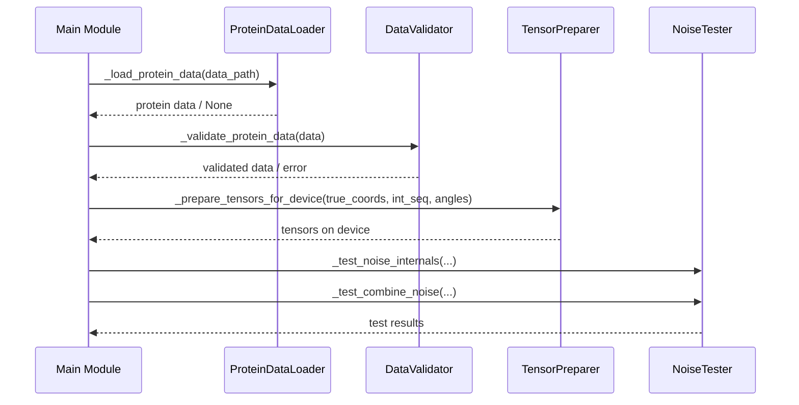

# Pull Request #54: Refactor ml_utils.py and utils.py into cohesive modules

## Status
- State: MERGED
- Created: 2025-04-12
- Updated: 2025-04-13
- Closed: 2025-04-13
- Merged: 2025-04-13

## Changes
- Additions: 4571
- Deletions: 3591
- Changed Files: 38

## Author
- Name: ImmortalDemonGod
- Login: ImmortalDemonGod
- Bot: No

## Assignees
- None

## Description
## Description
This PR addresses Task #41 to refactor both ml_utils.py and utils.py into more cohesive modules.

### Changes Made

#### ML Utils Package
- Created a package structure with specialized modules:
  - atom_utils.py: Functions for atom manipulation
  - angle_utils.py: Functions for angle calculations
  - coordinate_transforms.py: Functions for coordinate transformations
  - loss_functions.py: Functions for loss calculations
  - tensor_ops.py: Basic tensor operations
  - main.py: Main logic from the original file

#### Utils Package
- Created a package structure with specialized modules:
  - rotation.py: Rotation and transformation functions
  - tensor_ops.py: Tensor manipulation functions
  - coordinate_utils.py: Coordinate processing functions
  - general.py: General utility functions

### Code Quality Improvements
- Increased cohesion by grouping related functions
- Reduced complexity by breaking down large functions
- Added dataclasses for configuration parameters
- Maintained backward compatibility with legacy functions

### Code Quality Scores
- Most modules now have a perfect score of 10/10
- coordinate_transforms.py: 9.09/10
- general.py: 9.38/10
- tensor_ops.py in utils: 8.41/10

### Testing
- All tests pass with the refactored code
- No functionality has been changed, only code organization

## Related Issues
Closes #41

---
Pull Request opened by [Augment Code](https://www.augmentcode.com/) with guidance from the PR author

## Summary by CodeRabbit

- **New Features**
  - Introduced enhanced modules for RNA structure prediction with advanced utilities for rotation, coordinate processing, tensor manipulation, and improved noise simulation.
  - Added a new configuration file for coverage metrics and module categories.

- **Refactor**
  - Reorganized and modularized internal functions for better maintainability and streamlined backward compatibility.
  
- **Tests**
  - Expanded the test suite to improve robustness and reliability across RNA prediction functionalities, including comprehensive coverage for multiple modules.
  - Introduced new test files to enhance coverage for the `ml_utils` module.

- **Chore**
  - Updated configuration files to reflect the latest performance metrics and internal improvements.

## Comments

### Comment by coderabbitai
- Created: 2025-04-12
- Author Association: NONE

## Walkthrough
This pull request updates coverage configurations and refactors the RNA prediction pipeline. The changes update the coverage metrics in `.coverage_config.json`, add a backup configuration file, and reorganize utility functions by splitting a monolithic utils file into dedicated submodules (rotation, tensor_ops, coordinate_utils, general) with re-exporting for backward compatibility. The `ml_utils` module is similarly overhauled into smaller focused modules (angle_utils, atom_utils, coordinate_transforms, loss_functions, main, tensor_ops) with redundant functions removed. In addition, test files have been refactored and new tests added to improve coverage.

## Changes

| File(s) | Change Summary |
|---------|----------------|
| `.coverage_config.json``.coverage_config.json.bak` | Updated coverage metrics and added a backup file with phase-specific coverage details. |
| `rna_predict/.../input_embedding/current/utils/*.py` | Refactored utility functions: moved functions from a monolithic utils file into dedicated submodules (rotation, tensor_ops, coordinate_utils, general) and re-exported via `__init__.py` for backward compatibility. |
| `rna_predict/.../mp_nerf/ml_utils/*.py` | Overhauled `ml_utils` by splitting large files into focused modules (angle_utils, atom_utils, coordinate_transforms, loss_functions, main, tensor_ops); removed deprecated functions and re-exported key functions for backward compatibility. |
| `tests/.../mp_nerf_tests/*.py` | Refactored test files: modularized helper methods, updated legacy function calls, and added new tests to improve coverage and validate the refactored code structure. |

## Sequence Diagram(s)

## Assessment against linked issues

| Objective                                                                     | Addressed | Explanation |
|-------------------------------------------------------------------------------|-----------|-------------|
| Improve code quality by splitting large files into smaller modules (#41)      | ✅        |             |

## Poem
> I hop through lines of code with cheer,  
> Splitting files to keep the structure clear.  
> Each module now stands so proudly neat,  
> A garden of functions, both fresh and sweet.  
> With tests in place and logic set aright,  
> My rabbit heart leaps at code so bright!

> [!TIP]
> 
> ⚡💬 Agentic Chat (Pro Plan, General Availability)
> 
> - We're introducing multi-step agentic chat in review comments and issue comments, within and outside of PR's. This feature enhances review and issue discussions with the CodeRabbit agentic chat by enabling advanced interactions, including the ability to create pull requests directly from comments and add commits to existing pull requests.
> 
> 

✨ Finishing Touches

- [ ]  📝 Generate Docstrings

---

🪧 Tips

### Chat

There are 3 ways to chat with [CodeRabbit](https://coderabbit.ai?utm_source=oss&utm_medium=github&utm_campaign=ImmortalDemonGod/RNA_PREDICT&utm_content=54):

- Review comments: Directly reply to a review comment made by CodeRabbit. Example:
  - `I pushed a fix in commit , please review it.`
  - `Generate unit testing code for this file.`
  - `Open a follow-up GitHub issue for this discussion.`
- Files and specific lines of code (under the "Files changed" tab): Tag `@coderabbitai` in a new review comment at the desired location with your query. Examples:
  - `@coderabbitai generate unit testing code for this file.`
  -	`@coderabbitai modularize this function.`
- PR comments: Tag `@coderabbitai` in a new PR comment to ask questions about the PR branch. For the best results, please provide a very specific query, as very limited context is provided in this mode. Examples:
  - `@coderabbitai gather interesting stats about this repository and render them as a table. Additionally, render a pie chart showing the language distribution in the codebase.`
  - `@coderabbitai read src/utils.ts and generate unit testing code.`
  - `@coderabbitai read the files in the src/scheduler package and generate a class diagram using mermaid and a README in the markdown format.`
  - `@coderabbitai help me debug CodeRabbit configuration file.`

Note: Be mindful of the bot's finite context window. It's strongly recommended to break down tasks such as reading entire modules into smaller chunks. For a focused discussion, use review comments to chat about specific files and their changes, instead of using the PR comments.

### CodeRabbit Commands (Invoked using PR comments)

- `@coderabbitai pause` to pause the reviews on a PR.
- `@coderabbitai resume` to resume the paused reviews.
- `@coderabbitai review` to trigger an incremental review. This is useful when automatic reviews are disabled for the repository.
- `@coderabbitai full review` to do a full review from scratch and review all the files again.
- `@coderabbitai summary` to regenerate the summary of the PR.
- `@coderabbitai generate docstrings` to [generate docstrings](https://docs.coderabbit.ai/finishing-touches/docstrings) for this PR.
- `@coderabbitai resolve` resolve all the CodeRabbit review comments.
- `@coderabbitai plan` to trigger planning for file edits and PR creation.
- `@coderabbitai configuration` to show the current CodeRabbit configuration for the repository.
- `@coderabbitai help` to get help.

### Other keywords and placeholders

- Add `@coderabbitai ignore` anywhere in the PR description to prevent this PR from being reviewed.
- Add `@coderabbitai summary` to generate the high-level summary at a specific location in the PR description.
- Add `@coderabbitai` anywhere in the PR title to generate the title automatically.

### CodeRabbit Configuration File (`.coderabbit.yaml`)

- You can programmatically configure CodeRabbit by adding a `.coderabbit.yaml` file to the root of your repository.
- Please see the [configuration documentation](https://docs.coderabbit.ai/guides/configure-coderabbit) for more information.
- If your editor has YAML language server enabled, you can add the path at the top of this file to enable auto-completion and validation: `# yaml-language-server: $schema=https://coderabbit.ai/integrations/schema.v2.json`

### Documentation and Community

- Visit our [Documentation](https://docs.coderabbit.ai) for detailed information on how to use CodeRabbit.
- Join our [Discord Community](http://discord.gg/coderabbit) to get help, request features, and share feedback.
- Follow us on [X/Twitter](https://twitter.com/coderabbitai) for updates and announcements.

---
