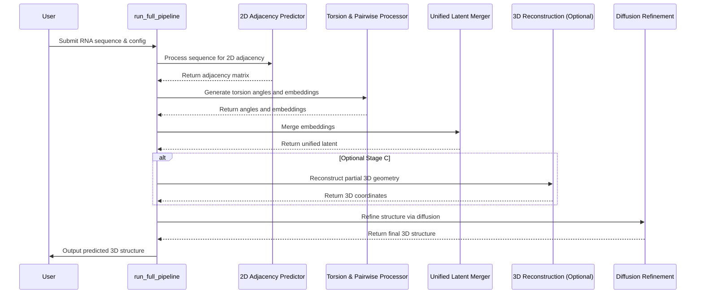

# Pull Request #55: docs: reorganize documentation structure for better clarity and maint…

## Status
- State: MERGED
- Created: 2025-04-13
- Updated: 2025-04-13
- Closed: 2025-04-13
- Merged: 2025-04-13

## Changes
- Additions: 4858
- Deletions: 347
- Changed Files: 39

## Author
- Name: ImmortalDemonGod
- Login: ImmortalDemonGod
- Bot: No

## Assignees
- None

## Description
# Documentation Structure Reorganization

## Overview
This PR reorganizes the documentation structure to improve clarity, maintainability, and navigation. The changes focus on creating a more logical hierarchy and grouping related documentation together.

## Key Changes

### 1. Best Practices Organization
- Created a dedicated `testing` subdirectory under `best_practices` for test-related documentation
- Moved and renamed files for better clarity:
  - `progressive_coverage.md` → `testing/progressive_coverage.md`
  - `test_coverage_strategy.md` → `testing/test_coverage_strategy.md`
  - `create_test_guidelines.md` → `testing/test_generation_prompt.md`

### 2. Directory Structure Improvements
- Organized documentation into clear categories:
  - `guides/` - User-facing documentation and tutorials
  - `best_practices/` - Development standards and guidelines
  - `pipeline/` - Pipeline-specific documentation
  - `reference/` - Technical reference materials

### 3. File Renaming and Cleanup
- Simplified long filenames for better readability
- Ensured consistent naming conventions across documentation
- Removed redundant information from filenames

## Benefits
- Improved navigation and discoverability of documentation
- Clearer separation of concerns between different types of documentation
- More maintainable structure for future documentation additions
- Better organization for new team members onboarding

## Testing
- No functional changes to the codebase
- All documentation links have been preserved
- File structure changes maintain backward compatibility

## Related Issues
- Addresses documentation organization concerns
- Improves maintainability of the documentation system

## Checklist
- [x] All documentation files are properly organized
- [x] File names are clear and consistent
- [x] No documentation content has been modified
- [x] All links and references are preserved
- [x] Directory structure follows logical grouping

## Summary by CodeRabbit

- **Documentation**
  - Added a comprehensive project overview with structured guides covering project architecture, user/developer documentation, and best practices.
  - Introduced detailed materials on Windows compatibility, stage-specific pipeline processes (from 2D predictions to 3D diffusion refinement), and extensive Hydra integration including gap analysis and a tutorial.
  - Added a new document outlining standard bond lengths and angles in RNA nucleotides.
- **New Features**
  - Enhanced the overall pipeline orchestration to improve RNA structure prediction performance.
- **Chores**
  - Removed an obsolete test sequence file.

## Comments

### Comment by coderabbitai
- Created: 2025-04-13
- Author Association: NONE

> [!CAUTION]
> ## Review failed
> 
> The pull request is closed.

## Walkthrough
The changes introduce a series of new documentation files detailing the RNA Predict project. These additions include an updated project README, guides for Windows compatibility, comprehensive pipeline design documents, and in-depth stage-specific documentation. New code elements such as an orchestrator function, stage processing methods, and a unified latent merger class are specified within the pipeline specification document. Additionally, several documents focus on integrating Hydra for configuration management along with a related tutorial, while one obsolete sequence file is removed.

## Changes

| File(s) | Change Summary |
|---------|----------------|
| `docs/README.md``docs/guides/.../windows_compatibility_plan.md` | Introduces a new README outlining project documentation structure and guidelines, and adds a Windows compatibility plan that details necessary path manipulation changes in scripts. |
| `docs/pipeline/integration/Integrated_RNA_3D_Prediction_Pipeline_Final_Comprehensive_Design.md``docs/pipeline/integration/full_pipeline_specification.md` | Adds comprehensive architectural design and detailed pipeline specifications, including new orchestrator functions, stage processing methods, and a unified latent merger class for RNA 3D prediction. |
| `docs/pipeline/integration/hydra_integration/components/stageA/StageA_2D_Adjacency.md``docs/pipeline/integration/hydra_integration/components/stageB/StageB_Torsion_Pairwise.md``docs/pipeline/integration/hydra_integration/components/stageC/StageC_3D_Reconstruction.md``docs/pipeline/integration/hydra_integration/components/stageD/StageD_Diffusion_Refinement.md``docs/pipeline/integration/hydra_integration/components/unified_latent/UnifiedLatentMerger.md` | Provides detailed, stage-specific documentation for each pipeline component (Stages A–D) and for the Unified Latent Merger, including new classes and functions specific to each stage. |
| `docs/pipeline/integration/hydra_integration/hydra_integration_gap_analysis.md``docs/pipeline/integration/hydra_integration/hydra_integration_master_document.md``docs/pipeline/integration/hydra_integration/components/stage_specific_documentation_plan.md``docs/pipeline/integration/hydra_integration/hydra_tutorial.md` | Introduces extensive documentation for Hydra integration with gap analysis, a master integration document, a stage-specific documentation plan, and a beginner-friendly Hydra tutorial for developers. |
| `predict_test.ct` | The file has been deleted; it previously contained nucleotide sequence entries used for testing. |

## Sequence Diagram(s)

## Poem
> I'm the rabbit of the docs, quick and spry,  
> Hopping over changes as the models fly,  
> New guides and pipelines I proudly behold,  
> With Hydra and stages so neatly told,  
> I celebrate each update in a joyful beat,  
> Leaping through code—oh, what a treat!  
> 🐇✨

---

📜 Recent review details

**Configuration used: CodeRabbit UI**
**Review profile: CHILL**
**Plan: Pro**

📥 Commits

Reviewing files that changed from the base of the PR and between 4072807de6cc4d29d2ec0515a9bf359b48d5e1d8 and 7999b69147036ee79d0ee555194495000ba7fd77.

📒 Files selected for processing (7)

* `docs/pipeline/integration/Integrated_RNA_3D_Prediction_Pipeline_Final_Comprehensive_Design.md` (1 hunks)
* `docs/pipeline/integration/hydra_integration/components/stage_specific_documentation_plan.md` (1 hunks)
* `docs/pipeline/integration/hydra_integration/hydra_integration_gap_analysis.md` (1 hunks)
* `docs/pipeline/integration/hydra_integration/hydra_tutorial.md` (1 hunks)
* `docs/pipeline/test_time_scaling.md` (1 hunks)
* `docs/reference/torsion_calculations/Standard Bond Lengths and Angles in RNA Nucleotides.md` (0 hunks)
* `docs/reference/torsion_calculations/Standard_Bond_Lengths_and_Angles_in_RNA_Nucleotides.md` (1 hunks)

---

🪧 Tips

### Chat

There are 3 ways to chat with [CodeRabbit](https://coderabbit.ai?utm_source=oss&utm_medium=github&utm_campaign=ImmortalDemonGod/RNA_PREDICT&utm_content=55):

- Review comments: Directly reply to a review comment made by CodeRabbit. Example:
  - `I pushed a fix in commit , please review it.`
  - `Generate unit testing code for this file.`
  - `Open a follow-up GitHub issue for this discussion.`
- Files and specific lines of code (under the "Files changed" tab): Tag `@coderabbitai` in a new review comment at the desired location with your query. Examples:
  - `@coderabbitai generate unit testing code for this file.`
  -	`@coderabbitai modularize this function.`
- PR comments: Tag `@coderabbitai` in a new PR comment to ask questions about the PR branch. For the best results, please provide a very specific query, as very limited context is provided in this mode. Examples:
  - `@coderabbitai gather interesting stats about this repository and render them as a table. Additionally, render a pie chart showing the language distribution in the codebase.`
  - `@coderabbitai read src/utils.ts and generate unit testing code.`
  - `@coderabbitai read the files in the src/scheduler package and generate a class diagram using mermaid and a README in the markdown format.`
  - `@coderabbitai help me debug CodeRabbit configuration file.`

Note: Be mindful of the bot's finite context window. It's strongly recommended to break down tasks such as reading entire modules into smaller chunks. For a focused discussion, use review comments to chat about specific files and their changes, instead of using the PR comments.

### CodeRabbit Commands (Invoked using PR comments)

- `@coderabbitai pause` to pause the reviews on a PR.
- `@coderabbitai resume` to resume the paused reviews.
- `@coderabbitai review` to trigger an incremental review. This is useful when automatic reviews are disabled for the repository.
- `@coderabbitai full review` to do a full review from scratch and review all the files again.
- `@coderabbitai summary` to regenerate the summary of the PR.
- `@coderabbitai generate docstrings` to [generate docstrings](https://docs.coderabbit.ai/finishing-touches/docstrings) for this PR.
- `@coderabbitai resolve` resolve all the CodeRabbit review comments.
- `@coderabbitai plan` to trigger planning for file edits and PR creation.
- `@coderabbitai configuration` to show the current CodeRabbit configuration for the repository.
- `@coderabbitai help` to get help.

### Other keywords and placeholders

- Add `@coderabbitai ignore` anywhere in the PR description to prevent this PR from being reviewed.
- Add `@coderabbitai summary` to generate the high-level summary at a specific location in the PR description.
- Add `@coderabbitai` anywhere in the PR title to generate the title automatically.

### CodeRabbit Configuration File (`.coderabbit.yaml`)

- You can programmatically configure CodeRabbit by adding a `.coderabbit.yaml` file to the root of your repository.
- Please see the [configuration documentation](https://docs.coderabbit.ai/guides/configure-coderabbit) for more information.
- If your editor has YAML language server enabled, you can add the path at the top of this file to enable auto-completion and validation: `# yaml-language-server: $schema=https://coderabbit.ai/integrations/schema.v2.json`

### Documentation and Community

- Visit our [Documentation](https://docs.coderabbit.ai) for detailed information on how to use CodeRabbit.
- Join our [Discord Community](http://discord.gg/coderabbit) to get help, request features, and share feedback.
- Follow us on [X/Twitter](https://twitter.com/coderabbitai) for updates and announcements.

---
