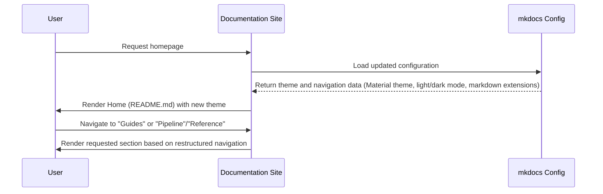

# Pull Request #57: feat: Add dark mode support with Material theme

## Status
- State: MERGED
- Created: 2025-04-13
- Updated: 2025-04-13
- Closed: 2025-04-13
- Merged: 2025-04-13

## Changes
- Additions: 106
- Deletions: 4
- Changed Files: 1

## Author
- Name: ImmortalDemonGod
- Login: ImmortalDemonGod
- Bot: No

## Assignees
- None

## Description
# Add Dark Mode Support with Material Theme

## Overview
This PR enhances the documentation site by switching to Material for MkDocs theme, which provides a modern, responsive design with built-in dark mode support and improved functionality.

## Changes
- Switch from ReadTheDocs to Material for MkDocs theme
- Add dark/light mode toggle with system preference detection
- Enable better code highlighting with line numbers and copy button
- Add additional markdown extensions for enhanced formatting:
  - Admonitions
  - Details/collapsible sections
  - Better code block support
  - Inline highlighting
  - Attribute lists
- Improve navigation and search functionality

## Testing
- Documentation builds successfully with the new theme
- Dark/light mode toggle works as expected
- Code highlighting and formatting is preserved
- All navigation links work correctly
- Search functionality is enhanced with better results

## Dependencies
- Added `mkdocs-material` package
- Added additional Python Markdown extensions

## Screenshots
[Add screenshots showing light and dark mode]

## Related Issues
Closes #[issue-number] (if applicable)

## Additional Notes
The Material theme also provides:
- Better mobile responsiveness
- Improved search functionality
- More customization options for future enhancements
- Better accessibility features

Please review the documentation at http://localhost:8001 to see the changes in action.

## Summary by CodeRabbit

- **Documentation**
  - Updated the documentation appearance with an enhanced theme featuring customizable light/dark modes.
  - Improved markdown rendering for a more polished viewing experience.
  - Restructured the navigation to provide clearer organization, now including dedicated sections for Guides, Pipeline, and Reference for easier access to key information.

## Comments

### Comment by coderabbitai
- Created: 2025-04-13
- Author Association: NONE

> [!CAUTION]
> ## Review failed
> 
> The pull request is closed.

## Walkthrough
The pull request updates the documentation configuration in the `mkdocs.yml` file. The theme is changed from `readthedocs` to a more detailed `material` theme with support for both light and dark modes. Multiple markdown extensions have been added to enhance formatting capabilities. Additionally, the navigation structure is reorganized: the home page now points to `README.md` instead of `index.md`, the "Development" section is removed, and new sections "Guides", "Pipeline", and "Reference" are introduced.

## Changes
| File(s)   | Change Summary |
|-----------|----------------|
| `mkdocs.yml` (Theme & Markdown Extensions) | Updated theme from `readthedocs` to `material` with detailed configuration including light/dark modes and color palettes. Added markdown extensions: `pymdownx.highlight`, `pymdownx.superfences`, `pymdownx.inlinehilite`, `pymdownx.snippets`, `admonition`, `pymdownx.details`, and `attr_list`. |
| `mkdocs.yml` (Navigation Structure) | Changed home page from `index.md` to `README.md`. Removed the "Development" section and added new sections: "Guides" (with subsections: Getting Started, Best Practices, Debugging), "Pipeline", and "Reference". |

## Sequence Diagram(s)

## Poem
> I'm a rabbit hopping with glee,  
> New docs and themes fill the spree.  
> Material hues and dark/light flair,  
> Guides and pipelines everywhere!  
> With whiskers twitching in delight, I cheer this change with all my might!  
> 🐇✨

---

📜 Recent review details

**Configuration used: CodeRabbit UI**
**Review profile: CHILL**
**Plan: Pro**

📥 Commits

Reviewing files that changed from the base of the PR and between f0a6e40ee8d47567abb3ab88bc7e69aec30c1aa9 and 1cb0ef3967337acbc1fb09c17dda3c6da7381f2b.

📒 Files selected for processing (1)

* `mkdocs.yml` (1 hunks)

---

🪧 Tips

### Chat

There are 3 ways to chat with [CodeRabbit](https://coderabbit.ai?utm_source=oss&utm_medium=github&utm_campaign=ImmortalDemonGod/RNA_PREDICT&utm_content=57):

- Review comments: Directly reply to a review comment made by CodeRabbit. Example:
  - `I pushed a fix in commit , please review it.`
  - `Generate unit testing code for this file.`
  - `Open a follow-up GitHub issue for this discussion.`
- Files and specific lines of code (under the "Files changed" tab): Tag `@coderabbitai` in a new review comment at the desired location with your query. Examples:
  - `@coderabbitai generate unit testing code for this file.`
  -	`@coderabbitai modularize this function.`
- PR comments: Tag `@coderabbitai` in a new PR comment to ask questions about the PR branch. For the best results, please provide a very specific query, as very limited context is provided in this mode. Examples:
  - `@coderabbitai gather interesting stats about this repository and render them as a table. Additionally, render a pie chart showing the language distribution in the codebase.`
  - `@coderabbitai read src/utils.ts and generate unit testing code.`
  - `@coderabbitai read the files in the src/scheduler package and generate a class diagram using mermaid and a README in the markdown format.`
  - `@coderabbitai help me debug CodeRabbit configuration file.`

Note: Be mindful of the bot's finite context window. It's strongly recommended to break down tasks such as reading entire modules into smaller chunks. For a focused discussion, use review comments to chat about specific files and their changes, instead of using the PR comments.

### CodeRabbit Commands (Invoked using PR comments)

- `@coderabbitai pause` to pause the reviews on a PR.
- `@coderabbitai resume` to resume the paused reviews.
- `@coderabbitai review` to trigger an incremental review. This is useful when automatic reviews are disabled for the repository.
- `@coderabbitai full review` to do a full review from scratch and review all the files again.
- `@coderabbitai summary` to regenerate the summary of the PR.
- `@coderabbitai generate docstrings` to [generate docstrings](https://docs.coderabbit.ai/finishing-touches/docstrings) for this PR.
- `@coderabbitai resolve` resolve all the CodeRabbit review comments.
- `@coderabbitai plan` to trigger planning for file edits and PR creation.
- `@coderabbitai configuration` to show the current CodeRabbit configuration for the repository.
- `@coderabbitai help` to get help.

### Other keywords and placeholders

- Add `@coderabbitai ignore` anywhere in the PR description to prevent this PR from being reviewed.
- Add `@coderabbitai summary` to generate the high-level summary at a specific location in the PR description.
- Add `@coderabbitai` anywhere in the PR title to generate the title automatically.

### CodeRabbit Configuration File (`.coderabbit.yaml`)

- You can programmatically configure CodeRabbit by adding a `.coderabbit.yaml` file to the root of your repository.
- Please see the [configuration documentation](https://docs.coderabbit.ai/guides/configure-coderabbit) for more information.
- If your editor has YAML language server enabled, you can add the path at the top of this file to enable auto-completion and validation: `# yaml-language-server: $schema=https://coderabbit.ai/integrations/schema.v2.json`

### Documentation and Community

- Visit our [Documentation](https://docs.coderabbit.ai) for detailed information on how to use CodeRabbit.
- Join our [Discord Community](http://discord.gg/coderabbit) to get help, request features, and share feedback.
- Follow us on [X/Twitter](https://twitter.com/coderabbitai) for updates and announcements.

---
