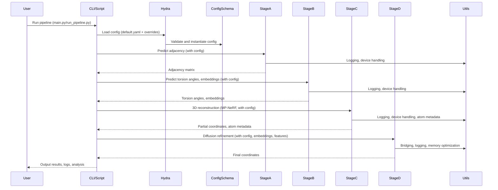

# Pull Request #62: Feature/36 hydra config management

## Status
- State: MERGED
- Created: 2025-04-21
- Updated: 2025-04-21
- Closed: 2025-04-21
- Merged: 2025-04-21

## Changes
- Additions: 23900
- Deletions: 12299
- Changed Files: 186

## Author
- Name: ImmortalDemonGod
- Login: ImmortalDemonGod
- Bot: No

## Assignees
- None

## Description
### Summary :memo:
_Write an overview about it._

### Details
_Describe more what you did on changes._
1. (...)
2. (...)

### Bugfixes :bug: (delete if dind't have any)
-

### Checks
- [ ] Closed #798
- [ ] Tested Changes
- [ ] Stakeholder Approval

## Summary by CodeRabbit

- **New Features**
  - Introduced Hydra-based configuration system with comprehensive YAML files and dataclasses for all pipeline stages.
  - Added new RNA MP-NeRF modules for folding, base placement, scaffolding, and utilities.
  - Implemented diffusion-based refinement with detailed configuration and memory optimizations.
  - Added triangular attention and multiplicative update modules for Stage B.
  - Introduced residue-to-atom bridging logic supporting atom-level embeddings.
  - Provided CLI entry points and shell script for Cosmic Ray worker management.
  - Added utilities for coordinate reshaping, atom extraction, and submission formatting.

- **Bug Fixes**
  - Fixed attention bias tensor shape handling and embedding dimension mismatches.
  - Improved device compatibility and tensor shape validation across pipeline stages.
  - Enhanced robustness against NaN values and fallback logic for missing features.
  - Corrected logging to avoid errors in unsupported environments.
  - Fixed adjacency matrix symmetrization and validation in Stage A.

- **Refactor**
  - Unified all pipeline components under Hydra configuration and structured logging.
  - Modularized and re-exported RNA MP-NeRF logic for maintainability.
  - Replaced explicit parameter passing with config-driven initialization throughout.
  - Refactored prediction interfaces for flexible coordinate tensor shapes and DataFrame generation.
  - Consolidated Stage B pipeline into a unified combined function with enhanced error handling.
  - Reworked Stage C reconstruction to support Hydra configs and richer metadata output.
  - Streamlined Stage D diffusion pipeline with structured config and improved memory handling.
  - Replaced print statements with logging for better debug control.
  - Removed obsolete fragmented tests; added structured property-based and integration tests.
  - Updated pipeline run scripts to use Hydra and standardized test sequences.

- **Documentation**
  - Added detailed documentation for pipeline configuration, HPC integration, and best practices.
  - Provided guides for RNA MP-NeRF modules and diffusion refinement pipeline.
  - Included orchestrator task templates and usage instructions.

- **Tests**
  - Expanded property-based and integration tests with mocks and dummy models.
  - Added comprehensive configuration validation and dimension tests.
  - Added debug scripts for AdaptiveLayerNorm and MP-NeRF NaN investigations.
  - Removed low-coverage autogenerated tests in favor of structured suites.

- **Chores**
  - Updated dependencies for Hydra, OmegaConf, and mutation testing tools.
  - Enhanced .gitignore patterns and added utility scripts for worker management.
  - Improved GitHub Actions workflow with dependency vulnerability scanning.
  - Cleaned up obsolete or redundant test and documentation files.

## Comments

### Comment by coderabbitai
- Created: 2025-04-21
- Author Association: NONE

> [!CAUTION]
> ## Review failed
> 
> The pull request is closed.

## Walkthrough

This update delivers a comprehensive refactor and expansion of the RNA prediction pipeline, introducing Hydra-based configuration management across all modules and pipeline stages (A–D). The codebase is modularized with structured configuration schemas, new utility modules, and improved device and error handling. Stage C's MP-NeRF implementation is split into submodules for constants, scaffolding, folding, atom positioning, and base placement. Stage D's diffusion refinement pipeline is unified, with robust bridging between residue-level and atom-level embeddings, and memory optimization utilities. Extensive logging, debug instrumentation, and configuration validation are added throughout. The documentation is expanded with new guides, configuration examples, and HPC integration instructions. Test coverage is improved with property-based and configuration-driven tests, while outdated or fragmented tests are removed.

## Changes

| File(s) / Path(s)                                                                                      | Change Summary |
|--------------------------------------------------------------------------------------------------------|---------------|
| `.coverage_config.json`                                                                                | Updated coverage metrics and last updated date. |
| `.gitignore`                                                                                           | Revised log, output, db, coverage, and test artifact patterns. |
| `.windsurfrules`                                                                                       | Added project procedural and best practice guidelines. |
| `cosmic-ray.dev.toml`, `start_worker.sh`                                                               | Added Cosmic Ray mutation testing config and worker script. |
| `pyproject.toml`, `requirements.txt`                                                                   | Added Hydra, OmegaConf, Cosmic Ray, py-cpuinfo, protenix dependencies. |
| `rna_predict/conf/README.md`, `rna_predict/conf/__init__.py`, `rna_predict/conf/utils.py`              | Added config system docs, package marker, and config utilities. |
| `rna_predict/conf/config_schema.py`                                                                    | New structured Hydra config schema with validation functions. |
| `rna_predict/conf/default.yaml`, `rna_predict/conf/model/*.yaml`, `rna_predict/conf/test/data.yaml`    | Added default and stage-specific Hydra YAML configs. |
| `rna_predict/conf/model/__init__.py`                                                                   | Added package marker for model configs. |
| `rna_predict/dataset/dataset_loader.py`                                                                | Disabled `@snoop` decorator. |
| `rna_predict/interface.py`                                                                             | Refactored to Hydra config, improved tensor handling, added CLI. |
| `rna_predict/main.py`, `rna_predict/run_pipeline.py`                                                   | Refactored to Hydra entry points, config-driven execution. |
| `rna_predict/pipeline/config.py`                                                                       | Added stub file for linter compliance. |
| `rna_predict/pipeline/stageA/adjacency/RFold_code.py`, `rfold_predictor.py`                            | Refactored for Hydra config, improved logging, device, checkpointing. |
| `rna_predict/pipeline/stageA/input_embedding/current/embedders.py`, `primitives/adaptive_layer_norm_utils.py`, `primitives/attention_utils_internal.py`, `utils/general.py` | Added debug logging, improved tensor shape handling, refactored sampling logic. |
| `rna_predict/pipeline/stageA/input_embedding/current/transformer/atom_attention.py`, `components/feature_processing.py`, `decoder.py`, `encoder.py` | Added `c_ref_element` param, improved feature dimension validation and debug. |
| `rna_predict/pipeline/stageA/input_embedding/current/transformer/common.py`, `encoder_components/feature_processing.py`, `encoder_components/forward_logic.py` | Improved safe tensor access, default feature generation, and optional input handling. |
| `rna_predict/pipeline/stageA/run_stageA.py`                                                            | Refactored to Hydra config, structured logging, modular main. |
| `rna_predict/pipeline/stageB/main.py`, `pairwise/main.py`, `pairwise/pairformer.py`, `pairwise/pairformer_wrapper.py`, `pairwise/protenix_integration.py`, `pairwise/triangular_attention.py`, `pairwise/triangular_multiplicative.py`, `torsion/torsion_bert_predictor.py`, `torsion/torsionbert_inference.py` | Unified config-driven initialization, improved logging, added new attention/multiplicative modules, robust tensor and device handling. |
| `rna_predict/pipeline/stageB/pairwise/pairformer_utils.py`                                             | Improved MSA sampling with shape preservation. |
| `rna_predict/pipeline/stageB/pairwise/pairformer_wrapper.py`                                           | Refactored to Hydra config, added config validation and device handling. |
| `rna_predict/pipeline/stageB/pairwise/protenix_integration.py`                                        | Refactored to Hydra config, improved embedding shape handling and logging. |
| `rna_predict/pipeline/stageC/mp_nerf/rna.py`, `rna/__init__.py`, `rna/rna_atom_positioning.py`, `rna/rna_base_placement.py`, `rna/rna_constants.py`, `rna/rna_folding.py`, `rna/rna_scaffolding.py`, `rna/rna_utils.py` | Split and modularized MP-NeRF RNA implementation, added explicit exports. |
| `rna_predict/pipeline/stageC/mp_nerf/final_kb_rna.py`                                                  | Added canonical phosphate oxygen bond lengths and connectivity. |
| `rna_predict/pipeline/stageC/stage_c_reconstruction.py`                                                | Refactored for Hydra config, improved validation, output metadata, logging. |
| `rna_predict/pipeline/stageD/config.py`, `utils/config_types.py`, `utils/config_utils.py`              | Added structured config schema and utilities for Stage D diffusion. |
| `rna__atom_bridge.py`, `components/diffusion_conditioning.py`, `components/diffusion_module.py`, `components/diffusion_utils.py`, `generator.py`, `inference/inference_mode.py`, `protenix_diffusion_manager.py`, `run_stageD_unified.py`, `training/training_mode.py`, `utils/tensor_utils.py` | Unified bridging logic, robust shape handling, config-driven execution, improved logging and validation. |
| `rna_predict/pipeline/stageD/memory_optimization/memory_fix.py`                                        | Removed memory fixers, retained/expanded input truncation utility. |
| `rna_predict/pipeline/stageD/run_stageD.py`                                                            | Unified Stage D runner, Hydra integration, input validation, bridging. |
| `rna_predict/pipeline/stageD/tensor_fixes/attention_fixes.py`                                          | Fixed attention bias dimension logic. |
| `rna_predict/print_rna_pipeline_output.py`, `run_all_pipeline.py`, `run_full_pipeline.py`              | Refactored for Hydra, structured logging, robust analysis, fallback handling. |
| `rna_predict/utils/__init__.py`, `utils/scatter_utils.py`, `utils/submission.py`, `utils/tensor_utils/embedding.py`, `utils/tensor_utils/residue_mapping.py`, `utils/tensor_utils/validation.py` | Added utility modules for submission, tensor mapping, validation, debug logging. |
| `docs/guides/best_practices/code_quality_best_practices.md`, `docs/guides/getting_started/Orchestrator_Task_Template_ROO.md`, `docs/pipeline/integration/hydra_integration/*`, `docs/pipeline/stageA/StageA_RFold.md`, `docs/pipeline/stageB/Stage_B.md`, `docs/pipeline/stageC/Stage_C.md`, `docs/pipeline/stageD/StageD_Diffusion_Refinement.md` | Expanded and updated documentation for config, pipeline stages, and HPC integration. |
| `predict_test.ct`                                                                                      | Added test data file. |
| `tests/conf/test_config.py`, `conftest.py`, `debug_adaptive_layernorm.py`, `debug_mpnerf_nan.py`, `integration/test_full_pipeline.py`, `integration/test_pipeline_dimensions.py` | Added/updated property-based and config-driven tests, debug scripts, improved error handling. |
| `rna_predict/pipeline/stageA/input_embedding/current/test_wrapped_utils.md`, `rna_predict/pipeline/stageB/pairwise/test_wrapped_main.md`, `rna_predict/pipeline/stageB/pairwise/test_wrapped_pairformer_wrapper.md`, `rna_predict/pipeline/stageB/pairwise/test_wrapped_protenix_integration.md`, `rna__schedule.py` | Removed outdated, fragmented, or redundant test and utility files. |

## Sequence Diagram(s)

## Possibly related PRs

- [ImmortalDemonGod/RNA_PREDICT#46](https://github.com/ImmortalDemonGod/RNA_PREDICT/pull/46): Implements the residue-to-atom bridging mechanism in Stage D diffusion, directly related to the bridging and tensor utilities refactored in this PR.
- [ImmortalDemonGod/RNA_PREDICT#45](https://github.com/ImmortalDemonGod/RNA_PREDICT/pull/45): Introduces progressive test coverage and `.coverage_config.json` management, which is updated and extended in this PR.
- [ImmortalDemonGod/RNA_PREDICT#54](https://github.com/ImmortalDemonGod/RNA_PREDICT/pull/54): Updates `.coverage_config.json` with new coverage metrics, similar to the coverage tracking updates in this PR.

## Poem

> 🐇  
> In the warren of code, a pipeline reborn,  
> With Hydra's config, our logic adorned.  
> From A to D, each stage now aligned,  
> With logging and docs, all neatly defined.  
> Residue to atom, our tensors now bridge,  
> On clusters and desktops, we leap ridge to ridge.  
> So hop along, friend, through this code garden green—  
> The future of RNA is robust and clean!  
> 🥕

> [!TIP]
> 
> ⚡💬 Agentic Chat (Pro Plan, General Availability)
> 
> - We're introducing multi-step agentic chat in review comments and issue comments, within and outside of PR's. This feature enhances review and issue discussions with the CodeRabbit agentic chat by enabling advanced interactions, including the ability to create pull requests directly from comments and add commits to existing pull requests.
> 
> 

✨ Finishing Touches

- [ ]  📝 Generate Docstrings

---

🪧 Tips

### Chat

There are 3 ways to chat with [CodeRabbit](https://coderabbit.ai?utm_source=oss&utm_medium=github&utm_campaign=ImmortalDemonGod/RNA_PREDICT&utm_content=62):

- Review comments: Directly reply to a review comment made by CodeRabbit. Example:
  - `I pushed a fix in commit , please review it.`
  - `Generate unit testing code for this file.`
  - `Open a follow-up GitHub issue for this discussion.`
- Files and specific lines of code (under the "Files changed" tab): Tag `@coderabbitai` in a new review comment at the desired location with your query. Examples:
  - `@coderabbitai generate unit testing code for this file.`
  -	`@coderabbitai modularize this function.`
- PR comments: Tag `@coderabbitai` in a new PR comment to ask questions about the PR branch. For the best results, please provide a very specific query, as very limited context is provided in this mode. Examples:
  - `@coderabbitai gather interesting stats about this repository and render them as a table. Additionally, render a pie chart showing the language distribution in the codebase.`
  - `@coderabbitai read src/utils.ts and generate unit testing code.`
  - `@coderabbitai read the files in the src/scheduler package and generate a class diagram using mermaid and a README in the markdown format.`
  - `@coderabbitai help me debug CodeRabbit configuration file.`

Note: Be mindful of the bot's finite context window. It's strongly recommended to break down tasks such as reading entire modules into smaller chunks. For a focused discussion, use review comments to chat about specific files and their changes, instead of using the PR comments.

### CodeRabbit Commands (Invoked using PR comments)

- `@coderabbitai pause` to pause the reviews on a PR.
- `@coderabbitai resume` to resume the paused reviews.
- `@coderabbitai review` to trigger an incremental review. This is useful when automatic reviews are disabled for the repository.
- `@coderabbitai full review` to do a full review from scratch and review all the files again.
- `@coderabbitai summary` to regenerate the summary of the PR.
- `@coderabbitai generate docstrings` to [generate docstrings](https://docs.coderabbit.ai/finishing-touches/docstrings) for this PR.
- `@coderabbitai resolve` resolve all the CodeRabbit review comments.
- `@coderabbitai configuration` to show the current CodeRabbit configuration for the repository.
- `@coderabbitai help` to get help.

### Other keywords and placeholders

- Add `@coderabbitai ignore` anywhere in the PR description to prevent this PR from being reviewed.
- Add `@coderabbitai summary` to generate the high-level summary at a specific location in the PR description.
- Add `@coderabbitai` anywhere in the PR title to generate the title automatically.

### CodeRabbit Configuration File (`.coderabbit.yaml`)

- You can programmatically configure CodeRabbit by adding a `.coderabbit.yaml` file to the root of your repository.
- Please see the [configuration documentation](https://docs.coderabbit.ai/guides/configure-coderabbit) for more information.
- If your editor has YAML language server enabled, you can add the path at the top of this file to enable auto-completion and validation: `# yaml-language-server: $schema=https://coderabbit.ai/integrations/schema.v2.json`

### Documentation and Community

- Visit our [Documentation](https://docs.coderabbit.ai) for detailed information on how to use CodeRabbit.
- Join our [Discord Community](http://discord.gg/coderabbit) to get help, request features, and share feedback.
- Follow us on [X/Twitter](https://twitter.com/coderabbitai) for updates and announcements.

---
