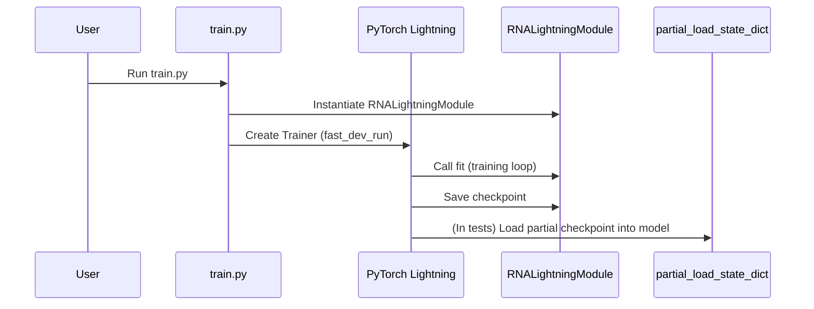

# Pull Request #63: M2 partial checkpoint cycle

## Status
- State: MERGED
- Created: 2025-04-21
- Updated: 2025-04-26
- Closed: 2025-04-26
- Merged: 2025-04-26

## Changes
- Additions: 10971
- Deletions: 5313
- Changed Files: 130

## Author
- Name: ImmortalDemonGod
- Login: ImmortalDemonGod
- Bot: No

## Assignees
- None

## Description
### Summary :memo:
_Write an overview about it._

### Details
_Describe more what you did on changes._
1. (...)
2. (...)

### Bugfixes :bug: (delete if dind't have any)
-

### Checks
- [ ] Closed #798
- [ ] Tested Changes
- [ ] Stakeholder Approval

## Summary by CodeRabbit

- **New Features**
  - Introduced PyTorch Lightning integration for streamlined training and checkpointing.
  - Added configuration options for LanceDB logging (stub implementation for now).
  - Provided utility for partial checkpoint loading to enable selective parameter restoration.
  - Added scripts for batch test generation and test stub creation.
  - Added a new RNA Lightning training module and example training script.
  - Added stub LanceDB logging functions as placeholders for future milestones.
  - Added utilities for managing partial checkpoints and trainable parameter filtering.
  - Added detailed tensor shape and sample dimension handling utilities for multi-sample diffusion.
  - Introduced comprehensive Stage D context and config validation utilities.
  - Added residue-to-atom bridging utilities with defensive shape checks and expansions.
  - Modularized Stage D diffusion pipeline with enhanced debugging and memory profiling.
  - Added robust NaN handling utilities for pipeline tensors.
  - Enhanced atom attention and transformer modules with improved shape compatibility and error handling.

- **Documentation**
  - Updated milestone documentation to reflect new requirements and integration strategies for Lightning and LanceDB.
  - Added detailed guides for adopting Lightning and LanceDB in the checkpoint workflow.
  - Added comprehensive documentation on Low-Rank Adaptation (LoRA) for Transformer models in PyTorch.

- **Tests**
  - Added integration and unit tests for Lightning training, partial checkpointing, and checkpoint loading utilities.
  - Added tests covering partial checkpointing on multiple model components and memory-efficient checkpointing.
  - Enhanced debug logging tests with improved logger state management and mocking.
  - Added new integration scripts and tests to verify full pipeline configuration and partial checkpoint workflows.
  - Added tests for configuration validation, error handling in Stage D diffusion, and shape consistency.
  - Marked long-running or hanging tests as skipped with detailed reasons.
  - Improved mocking and robustness in tests for diffusion manager and model components.
  - Added property-based tests for error conditions and configuration structure.
  - Added tests verifying correct broadcasting of embeddings and tensor shape adaptations.
  - Refined tests to use Hydra configs and reduce resource usage with minimal model sizes.
  - Added tests for diffusion sampling, inference, and multi-sample tensor handling.

- **Chores**
  - Added Lightning as a new dependency in project requirements.
  - Updated project version to 1.0.0.
  - Removed deprecated or unused files and imports.
  - Refactored pipeline scripts for modularity and clarity.
  - Improved logging consistency and debug output across modules.
  - Added pytest fixture to set project root as working directory for tests.
  - Removed legacy pipeline output printing script and related tests.
  - Cleaned up configuration loading and Hydra initialization logic.

## Comments

### Comment by coderabbitai
- Created: 2025-04-21
- Author Association: NONE

## Walkthrough

This update introduces a suite of enhancements and new features centered around robust checkpointing and logging for the RNA prediction pipeline. Key additions include a stub implementation for LanceDB logging, integration of PyTorch Lightning for streamlined training and checkpointing, and comprehensive utilities and tests for partial checkpoint loading. Documentation is updated to reflect these requirements and provide a migration guide. New scripts and modules facilitate batch test generation, partial checkpoint handling, and Lightning-based training. Extensive integration and unit tests verify the correctness of partial checkpoint cycles across various model stages. Additional improvements include enhanced debug logging tests and a detailed LoRA documentation addition.

## Changes

| File(s)                                                                                       | Change Summary |
|-----------------------------------------------------------------------------------------------|---------------|
| `docs/pipeline/kaggle_info/M2_Plan.md``docs/pipeline/kaggle_info/m2_partial_checkpoint_plan.md``docs/reference/advanced_methods/lora.md` | Updated documentation to add LanceDB logger as a must-have for M2, describe stub implementation, and provide a migration guide for integrating PyTorch Lightning and LanceDB into the checkpoint workflow. Added comprehensive new LoRA documentation covering concepts, workflows, and best practices. |
| `pyproject.toml``requirements.txt`                                                        | Added `lightning>=2.2` as a new dependency for PyTorch Lightning integration. |
| `rna_predict/conf/config_schema.py`                                                           | Extended multiple config dataclasses with new fields for parameter freezing, model initialization, diffusion model configuration, and LanceDB logging integration (stub in M2). |
| `rna_predict/scripts/batch_test_generator.py``rna_predict/scripts/hypot_test_gen.py`      | Introduced new scripts: a stub batch test generator for Python files and a utility for removing leading zeros and logger lines from text. |
| `rna_predict/train.py`                                                                        | Added a script to launch model training using PyTorch Lightning with a minimal fast development run. |
| `rna_predict/training/rna_lightning_module.py`                                                | Added `RNALightningModule` as a minimal PyTorch Lightning module encapsulating the full RNA prediction pipeline for training and inference. |
| `rna_predict/utils/checkpoint.py`                                                             | Introduced `partial_load_state_dict` for robust, partial checkpoint loading into PyTorch models with detailed error reporting and warnings. |
| `rna_predict/utils/lance_logger.py`                                                           | Added stub LanceDB logging functions (`lance_log_event`, `lance_log_metrics`) as placeholders for future real implementation. |
| `rna_predict/pipeline/stageB/pairwise/pairformer.py`                                          | Refactored dictionary construction for `PairformerBlockConfig` instantiation without logic changes. |
| `rna_predict/pipeline/stageC/stage_c_reconstruction.py`                                       | Changed `StageCReconstruction` to inherit from `torch.nn.Module`; added memory usage logging and changed default logger level from WARNING to INFO when debug logging is disabled. |
| `tests/integration/test_lightning_trainer.py``tests/integration/test_partial_checkpoint_cycle.py``tests/integration/test_partial_checkpoint_stageB.py``tests/integration/test_partial_checkpoint_stageD.py` | Added integration tests covering Lightning Trainer fast dev run, partial checkpoint cycles for dummy and real models, and memory-efficient checkpointing in diffusion modules. |
| `tests/unit/test_checkpoint.py`                                                               | Added unit tests for `partial_load_state_dict` covering strict and non-strict loading, handling of extra keys, and shape mismatch errors. |
| `tests/test_debug_logging.py`                                                                 | Improved debug logging tests with enhanced logger state management, mocking to avoid heavy computation, and robust error reporting. |
| `rna_predict/pipeline/stageA/adjacency/rfold_predictor.py`                                    | Changed `StageARFoldPredictor` to inherit from `torch.nn.Module`; added memory usage logging and parameter freezing support. |
| `rna_predict/pipeline/stageA/input_embedding/current/transformer/attention.py`                 | Enhanced gating application in `AttentionPairBias` to handle flexible tensor shape adaptation and broadcasting with multiple fallback strategies. |
| `rna_predict/pipeline/stageA/input_embedding/current/transformer/encoder_components/forward_logic.py` | Added detailed debug instrumentation and shape consistency enforcement in style embedding processing and coordinate input handling. |
| `rna_predict/pipeline/stageA/input_embedding/current/transformer/encoder_components/initialization.py` | Propagated optional `minimal_pair_embedding_dim` config attribute to created `AtomTransformer` instance. |
| `rna_predict/pipeline/stageA/input_embedding/current/transformer/encoder_components/pair_embedding.py` | Added conditional early return to create minimal pair embedding tensor when configured, bypassing full computation. |
| `rna_predict/pipeline/stageA/input_embedding/current/utils/coordinate_utils.py`               | Added debug print statements to `broadcast_token_to_atom` for tensor shape visibility. |
| `rna_predict/pipeline/stageA/run_stageA.py`                                                   | Added debug log statement confirming logger functionality during Stage A run. |
| `rna_predict/pipeline/stageB/main.py`                                                        | Adjusted `ProtenixIntegration` config to align embedding dimensions dynamically to prevent dimension mismatches. |
| `rna_predict/pipeline/stageB/pairwise/main.py`                                               | Improved debug output for nested `protenix_integration` config keys and dimension values. |
| `rna_predict/pipeline/stageB/pairwise/pairformer_wrapper.py`                                  | Enhanced config extraction and validation; added parameter freezing; adjusted default dims; added detailed debug and memory logging; improved error handling and tensor dimension management. |
| `rna_predict/pipeline/stageB/pairwise/protenix_integration.py`                               | Refactored to store config parameters as instance attributes; added detailed debug logging; padded/truncated `ref_element` feature for fixed size. |
| `rna_predict/pipeline/stageB/pairwise/triangular_multiplicative.py`                          | Removed unused import and redundant variable assignment in `TriangleMultiplicativeUpdate`. |
| `rna_predict/pipeline/stageB/torsion/torsion_bert_predictor.py`                              | Refactored `StageBTorsionBertPredictor` to inherit from `torch.nn.Module`; improved config extraction and validation; switched to HuggingFace `AutoModel` and `AutoTokenizer`; added robust error handling and debug logging; added test compatibility fixes. |
| `rna_predict/pipeline/stageB/torsion/torsionbert_inference.py`                               | Modified dummy model forward to handle missing or unexpected inputs gracefully, always returning valid output tensors. |
| `rna_predict/pipeline/stageD/config.py`                                                     | Added new `FeatureDimensionsConfig` dataclass and integrated it into `DiffusionConfig`. |
| `rna_predict/pipeline/stageD/diffusion/bridging/hybrid_bridging_template.py`                 | Added new function to convert sparse Stage C atom features to dense atom tensors aligned with canonical atom indices, with extensive debug logging. |
| `rna__atom_bridge.py`                      | Added extensive debug logging, validation, and robustness improvements; enhanced config extraction; added bridging of Stage C outputs; removed memory preprocessing; added defensive shape checks. |
| `rna__conditioning.py`                 | Removed dimension alignment code; added debug prints; made constructor parameters mandatory without defaults. |
| `rna__module.py`                       | Removed default parameter values; added debug logging; enforced strict config requirements; updated type hints; assigned new instance variables explicitly. |
| `rna__mode.py`                         | Added config loading helper; updated `run_inference_mode` to accept optional config; added debug prints and output shape validation against config. |
| `rna_predict/pipeline/stageD/diffusion/protenix_diffusion_manager.py`                       | Added strict config validation and parsing; added memory logging; changed to subclass `nn.Module`; improved initialization and inference logic; added debug instrumentation. |
| `rna_predict/pipeline/stageD/diffusion/run_stageD_unified.py`                               | Added config-driven dimension extraction; defensive config flattening; added residue-level embedding checks; replaced bridging logic with safe calls; enhanced debug instrumentation. |
| `rna__mode.py`                           | Reordered dataclass field `original_trunk_embeddings_ref` without logic change. |
| `rna_predict/pipeline/stageD/diffusion/utils/config_utils.py`                               | Removed fallback dimension defaults; added strict validation for required diffusion config parameters; updated tensor initializations to use config values. |
| `rna_predict/pipeline/stageD/memory_optimization/test_memory.py`                           | Updated test setup to use config-driven tensor shapes and parameters instead of hardcoded values; adjusted assertions accordingly. |
| `rna_predict/pipeline/stageD/run_stageD.py`                                                | Added extensive debug logging and memory usage tracking; replaced hardcoded sizes with config-driven values; removed residue-to-atom bridging; added defensive shape checks; improved config extraction and validation; added minimal memory run slicing. |
| `rna_predict/run_full_pipeline.py`                                                        | Improved config handling in Stage C bridging step; added debug logging for Stage D config and diffusion config; added debug patch for diffusion config inspection. |
| `rna_predict/utils/checkpointing.py`                                                      | Added utility functions to save trainable parameters only and to retrieve trainable parameters optionally filtered by substrings. |
| `rna_predict/utils/tensor_utils/embedding.py`                                             | Added debug print statements to `residue_to_atoms` for input shape and type visibility. |
| `setup.py`                                                                               | Updated package version from "0.1.0" to "1.0.0". |
| `tests/integration/partial_checkpoint_full_pipeline_entry.py`                            | Added integration test script with Hydra config loading and environment validation. |
| `tests/integration/partial_checkpoint_full_pipeline_script.py`                           | Added integration test script validating config presence, Hydra initialization, pipeline construction, and dummy checkpoint logic with detailed debug output. |
| `tests/integration/test_partial_checkpoint_full_pipeline.py`                            | Added full integration test of partial checkpointing with Hydra config, training steps, checkpoint save/load, and inference validation. |
| `tests/integration/test_partial_checkpoint_stageA.py`                                   | Added integration test for Stage A partial checkpointing verifying parameter freezing, checkpoint save/load, optimizer step, and forward pass correctness. |
| `tests/integration/test_partial_checkpoint_stageB_unit.py`                              | Added minimal unit-level alias test file for Stage B partial checkpointing importing tests from integration test. |
| `tests/integration/test_stageD_config_errors.py`                                        | Added integration tests verifying error handling for missing or malformed Stage D config inputs and trunk embeddings. |
| `tests/interface/test_interface.py`                                                    | Added explicit config keys for device and model path; mocked HuggingFace model/tokenizer loading; improved test robustness and clarity. |
| `tests/interface/test_interface_mpnerf_nan.py`                                         | Added unique error tags to assertion messages; adjusted atom count threshold; added Hypothesis-decorated test variant. |
| `tests/stageB/pairwise/test_msa_components.py`                                        | Marked hanging/skipping tests; expanded config parameters; added detailed docstrings and debug prints; added manual test runner. |
| `tests/stageB/pairwise/test_protenix_integration_comprehensive.py`                    | Added regression test to prevent NameError in `build_embeddings`. |
| `tests/stageB/pairwise/test_template_and_sampling.py`                                | Removed unused imports. |
| `tests/stageB/pairwise/test_template_and_sampling_hypothesis.py`                     | Simplified exception handling clause in test. |
| `tests/stageB/pairwise/test_verify_pairformer_wrapper.py`                            | Streamlined tests; added config key assertions; enhanced block-level attribute checks; added property-based forward shape test; improved cleanup. |
| `tests/stageB/test_combined_torsion_pairformer.py`                                  | Removed unused import. |
| `tests/stageB/test_hydra_integration.py`                                           | Removed Hydra dependency; replaced config override test with direct OmegaConf config; clarified comments. |
| `tests/stageB/test_main_comprehensive.py`                                         | Removed Hydra imports; expanded torsion_bert config; skipped hanging property-based test with detailed reason. |
| `tests/stageB/torsion/test_stageB_torsionbert_predictor_comprehensive.py`          | Flattened config structure; restricted fuzzing inputs; mocked model/tokenizer loading; removed unused imports and variables. |
| `tests/stageB/torsion/test_torsionbert_predictor_hypothesis.py`                   | Removed unused imports. |
| `tests/stageB/torsion/test_verify_torsionbert_predictor.py`                      | Added skip marker to hanging real model test; removed unused imports; expanded docstring. |
| `tests/stageB/torsion/test_verify_torsionbert_predictor_hypothesis.py`            | Removed redundant local import. |
| `tests/stageD/diffusion/test_diffusion_conditioning.py`                           | Removed unused import. |
| `tests/stageD/diffusion/test_diffusion_module.py`                                | Added new parameters to constructor calls; removed warning checks; updated error handling to standard exceptions. |
| `tests/stageD/integration/test_run_stageD_comprehensive.py`                      | Updated tests to use atom-level embeddings with 5 atoms per residue; nested config changes; enhanced preprocessing truncation logic; improved debug logging. |
| `tests/stageD/integration/test_run_stageD_diffusion.py`                          | Reorganized config nesting; updated test setup and inputs to residue-level dimensions; added debug prints; updated mode access. |
| `tests/stageD/unit/manager/conftest.py`                                          | Enhanced config override processing in fixture to nest keys properly under diffusion and inference; minor formatting changes. |
| `tests/stageD/unit/manager/test_protenix_diffusion_manager.py`                   | Improved mocking strategy for diffusion module; simplified call assertions; removed unused imports. |
| `tests/stageD/unit/shape/test_stageD_shape_tests.py`                            | Added multiple Hypothesis-based tests verifying error handling for atom-level vs residue-level embedding misuse; added unique error codes; minor cleanup. |
| `tests/test_config.py`                                                          | Added clarifying comments about Hydra config path relative to working directory. |
| `tests/test_stageD_fix.py`                                                      | Added missing `profile_size` parameter to test config dictionary. |

## Sequence Diagram(s)

## Possibly related PRs

- ImmortalDemonGod/RNA_PREDICT#46: The main PR introduces a comprehensive residue-to-atom bridging mechanism in the Stage D diffusion pipeline, replacing previous ad-hoc shape validation and fixes, and refactors multiple pipeline components to integrate this bridging approach; the retrieved PR (#46) also implements this residue-atom unification via bridging utilities and updates tensor utilities, diffusion modules, and pipeline integration accordingly, including extensive tests and documentation—thus, the changes in the main PR are directly related and complementary to those in the retrieved PR.

## Poem

> In the warren where code bunnies dwell,  
> A Lightning spark now trains quite well.  
> Checkpoints hop—partial or whole—  
> Through carrot fields of model soul.  
> LanceDB logs, for now, just sleep,  
> Awaiting M3’s promises to keep.  
> With every hop, our tests all cheer—  
> The future’s bright for bunnies here!  
>  
>  (\(\  
>  ( -.-)  
>  o_(")(")

---

🪧 Tips

### Chat

There are 3 ways to chat with [CodeRabbit](https://coderabbit.ai?utm_source=oss&utm_medium=github&utm_campaign=ImmortalDemonGod/RNA_PREDICT&utm_content=63):

- Review comments: Directly reply to a review comment made by CodeRabbit. Example:
  - `I pushed a fix in commit , please review it.`
  - `Generate unit testing code for this file.`
  - `Open a follow-up GitHub issue for this discussion.`
- Files and specific lines of code (under the "Files changed" tab): Tag `@coderabbitai` in a new review comment at the desired location with your query. Examples:
  - `@coderabbitai generate unit testing code for this file.`
  -	`@coderabbitai modularize this function.`
- PR comments: Tag `@coderabbitai` in a new PR comment to ask questions about the PR branch. For the best results, please provide a very specific query, as very limited context is provided in this mode. Examples:
  - `@coderabbitai gather interesting stats about this repository and render them as a table. Additionally, render a pie chart showing the language distribution in the codebase.`
  - `@coderabbitai read src/utils.ts and generate unit testing code.`
  - `@coderabbitai read the files in the src/scheduler package and generate a class diagram using mermaid and a README in the markdown format.`
  - `@coderabbitai help me debug CodeRabbit configuration file.`

Note: Be mindful of the bot's finite context window. It's strongly recommended to break down tasks such as reading entire modules into smaller chunks. For a focused discussion, use review comments to chat about specific files and their changes, instead of using the PR comments.

### CodeRabbit Commands (Invoked using PR comments)

- `@coderabbitai pause` to pause the reviews on a PR.
- `@coderabbitai resume` to resume the paused reviews.
- `@coderabbitai review` to trigger an incremental review. This is useful when automatic reviews are disabled for the repository.
- `@coderabbitai full review` to do a full review from scratch and review all the files again.
- `@coderabbitai summary` to regenerate the summary of the PR.
- `@coderabbitai generate sequence diagram` to generate a sequence diagram of the changes in this PR.
- `@coderabbitai resolve` resolve all the CodeRabbit review comments.
- `@coderabbitai configuration` to show the current CodeRabbit configuration for the repository.
- `@coderabbitai help` to get help.

### Other keywords and placeholders

- Add `@coderabbitai ignore` anywhere in the PR description to prevent this PR from being reviewed.
- Add `@coderabbitai summary` to generate the high-level summary at a specific location in the PR description.
- Add `@coderabbitai` anywhere in the PR title to generate the title automatically.

### CodeRabbit Configuration File (`.coderabbit.yaml`)

- You can programmatically configure CodeRabbit by adding a `.coderabbit.yaml` file to the root of your repository.
- Please see the [configuration documentation](https://docs.coderabbit.ai/guides/configure-coderabbit) for more information.
- If your editor has YAML language server enabled, you can add the path at the top of this file to enable auto-completion and validation: `# yaml-language-server: $schema=https://coderabbit.ai/integrations/schema.v2.json`

### Documentation and Community

- Visit our [Documentation](https://docs.coderabbit.ai) for detailed information on how to use CodeRabbit.
- Join our [Discord Community](http://discord.gg/coderabbit) to get help, request features, and share feedback.
- Follow us on [X/Twitter](https://twitter.com/coderabbitai) for updates and announcements.

---
