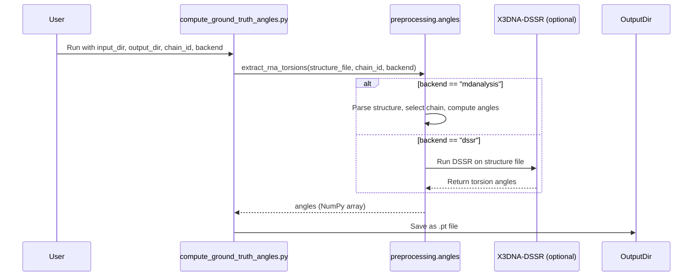

# Pull Request #67: Fix/training-loss-function-implementation

## Status
- State: MERGED
- Created: 2025-05-04
- Updated: 2025-05-04
- Closed: 2025-05-04
- Merged: 2025-05-04

## Changes
- Additions: 2678
- Deletions: 7
- Changed Files: 13

## Author
- Name: ImmortalDemonGod
- Login: ImmortalDemonGod
- Bot: No

## Assignees
- None

## Description
- implement robust field extraction for chain_id and pdb_path
- enhance error diagnostics for missing structure file paths
- maintain compatibility with both dict and numpy record formats

### Summary :memo:
_Write an overview about it._

### Details
_Describe more what you did on changes._
1. (...)
2. (...)

### Bugfixes :bug: (delete if dind't have any)
-

### Checks
- [ ] Closed #798
- [ ] Tested Changes
- [ ] Stakeholder Approval

## Summary by CodeRabbit

- **New Features**
  - Added a comprehensive user guide for setting up X3DNA-DSSR for RNA structure analysis, including installation steps and license information.
  - Introduced functionality to extract RNA torsion angles from structure files, supporting both MDAnalysis and DSSR backends.
  - Provided a command-line script to compute and save ground truth RNA torsion angles as PyTorch tensors.
- **Bug Fixes**
  - Improved angle extraction in datasets to handle missing or invalid structure files more robustly.
- **Documentation**
  - Added detailed setup and legal compliance documentation for X3DNA-DSSR.
- **Tests**
  - Introduced extensive tests for RNA torsion angle extraction, performance, and DSSR installation verification.
  - Added property-based and CLI tests for angle extraction and script execution.
- **Refactor**
  - Updated import paths in utility scripts for improved module resolution.
  - Replaced an external utility import with a local implementation in test code.
- **Style**
  - Minor syntax corrections in test files for improved readability.

## Comments

### Comment by coderabbitai
- Created: 2025-05-04
- Author Association: NONE

## Walkthrough

This set of changes introduces a comprehensive RNA torsion angle extraction pipeline, including documentation, preprocessing modules, scripts for computing ground truth angles, and extensive testing. A new guide explains how to install and license the X3DNA-DSSR tool for RNA structure analysis. The core dataset loader now extracts torsion angles using a new preprocessing module, which supports both MDAnalysis and (future) DSSR backends. Scripts and tests are provided to automate angle extraction, verify DSSR installation, and benchmark performance. Additional minor changes improve import handling and test code clarity.

## Changes

| File(s)                                                                                       | Change Summary |
|----------------------------------------------------------------------------------------------|---------------|
| `docs/guides/x3dna_dssr_setup.md`                                                            | Added a detailed setup and legal compliance guide for installing and using X3DNA-DSSR in RNA workflows, including academic license text. |
| `rna_predict/dataset/loader.py`                                                              | Implemented the `_load_angles` method in `RNADataset` to extract RNA torsion angles using the new preprocessing module, with robust error handling and backend selection. |
| `rna_predict/dataset/preprocessing/angles.py`                                                | New module to extract RNA backbone and glycosidic torsion angles from structure files, supporting backend selection and robust file/chain handling. |
| `rna_predict/dataset/preprocessing/compute_ground_truth_angles.py`                           | New script to compute and save RNA torsion angles from structure files as PyTorch tensors, supporting backend and chain selection via CLI. |
| `rna_predict/dataset/tmp_tests/test_angle_extraction_perf.py`                                | New script to benchmark performance and memory usage of RNA torsion angle extraction, including format conversion and validation. |
| `rna_predict/dataset/tmp_tests/test_compute_ground_truth_angles.py`                          | New test suite for the ground truth angle computation script, covering CLI and direct invocation, output validation, and error cases. |
| `rna_predict/dataset/tmp_tests/test_dssr_installation.py`,`rna_predict/dataset/tmp_tests/test_x3dssr_installation.py` | New tests and a standalone script to verify X3DNA-DSSR installation and error handling, including subprocess-based version checks and troubleshooting output. |
| `rna_predict/dataset/tmp_tests/test_extract_angles.py`                                       | New comprehensive test suite for the angle extraction module, covering error cases, edge cases, smoke tests, and internal helper utilities. |
| `scripts/test_utils/batch_test_generator.py`                                                 | Changed import of `run_test_generation` to a relative import, adding script directory to `sys.path`. |
| `tests/common/test_batch_test_generator.py`                                                  | Removed a trailing comma in a context manager argument for syntactic clarity. |
| `tests/common/test_remove_logger_lines.py`                                                   | Replaced imported `remove_logger_lines` with a new local implementation and updated the test accordingly. |

## Sequence Diagram(s)

## Poem

> In burrows deep, with code so neat,  
> I nibble through RNA’s winding street.  
> Angles extracted, chains aligned,  
> DSSR and MDAnalysis combined!  
> With tests and docs, the pipeline’s strong—  
> Hopping forward, science hops along!  
> 🐇✨

✨ Finishing Touches

- [ ]  📝 Generate Docstrings

---

🪧 Tips

### Chat

There are 3 ways to chat with [CodeRabbit](https://coderabbit.ai?utm_source=oss&utm_medium=github&utm_campaign=ImmortalDemonGod/RNA_PREDICT&utm_content=67):

- Review comments: Directly reply to a review comment made by CodeRabbit. Example:
  - `I pushed a fix in commit , please review it.`
  - `Generate unit testing code for this file.`
  - `Open a follow-up GitHub issue for this discussion.`
- Files and specific lines of code (under the "Files changed" tab): Tag `@coderabbitai` in a new review comment at the desired location with your query. Examples:
  - `@coderabbitai generate unit testing code for this file.`
  -	`@coderabbitai modularize this function.`
- PR comments: Tag `@coderabbitai` in a new PR comment to ask questions about the PR branch. For the best results, please provide a very specific query, as very limited context is provided in this mode. Examples:
  - `@coderabbitai gather interesting stats about this repository and render them as a table. Additionally, render a pie chart showing the language distribution in the codebase.`
  - `@coderabbitai read src/utils.ts and generate unit testing code.`
  - `@coderabbitai read the files in the src/scheduler package and generate a class diagram using mermaid and a README in the markdown format.`
  - `@coderabbitai help me debug CodeRabbit configuration file.`

### Support

Need help? Create a ticket on our [support page](https://www.coderabbit.ai/contact-us/support) for assistance with any issues or questions.

Note: Be mindful of the bot's finite context window. It's strongly recommended to break down tasks such as reading entire modules into smaller chunks. For a focused discussion, use review comments to chat about specific files and their changes, instead of using the PR comments.

### CodeRabbit Commands (Invoked using PR comments)

- `@coderabbitai pause` to pause the reviews on a PR.
- `@coderabbitai resume` to resume the paused reviews.
- `@coderabbitai review` to trigger an incremental review. This is useful when automatic reviews are disabled for the repository.
- `@coderabbitai full review` to do a full review from scratch and review all the files again.
- `@coderabbitai summary` to regenerate the summary of the PR.
- `@coderabbitai generate docstrings` to [generate docstrings](https://docs.coderabbit.ai/finishing-touches/docstrings) for this PR.
- `@coderabbitai generate sequence diagram` to generate a sequence diagram of the changes in this PR.
- `@coderabbitai resolve` resolve all the CodeRabbit review comments.
- `@coderabbitai configuration` to show the current CodeRabbit configuration for the repository.
- `@coderabbitai help` to get help.

### Other keywords and placeholders

- Add `@coderabbitai ignore` anywhere in the PR description to prevent this PR from being reviewed.
- Add `@coderabbitai summary` to generate the high-level summary at a specific location in the PR description.
- Add `@coderabbitai` anywhere in the PR title to generate the title automatically.

### CodeRabbit Configuration File (`.coderabbit.yaml`)

- You can programmatically configure CodeRabbit by adding a `.coderabbit.yaml` file to the root of your repository.
- Please see the [configuration documentation](https://docs.coderabbit.ai/guides/configure-coderabbit) for more information.
- If your editor has YAML language server enabled, you can add the path at the top of this file to enable auto-completion and validation: `# yaml-language-server: $schema=https://coderabbit.ai/integrations/schema.v2.json`

### Documentation and Community

- Visit our [Documentation](https://docs.coderabbit.ai) for detailed information on how to use CodeRabbit.
- Join our [Discord Community](http://discord.gg/coderabbit) to get help, request features, and share feedback.
- Follow us on [X/Twitter](https://twitter.com/coderabbitai) for updates and announcements.

---
