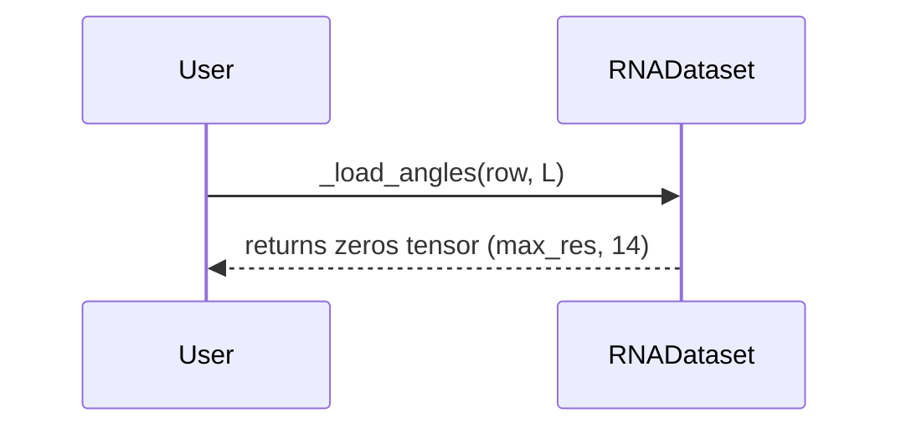

# Pull Request #68: Revert "Fix/training-loss-function-implementation"

## Status
- State: MERGED
- Created: 2025-05-04
- Updated: 2025-05-04
- Closed: 2025-05-04
- Merged: 2025-05-04

## Changes
- Additions: 7
- Deletions: 2678
- Changed Files: 13

## Author
- Name: ImmortalDemonGod
- Login: ImmortalDemonGod
- Bot: No

## Assignees
- None

## Description
Reverts ImmortalDemonGod/RNA_PREDICT#67

## Summary by CodeRabbit

- **Bug Fixes**
	- Replaced RNA torsion angle extraction with a placeholder, returning zero tensors in data loading.
- **Documentation**
	- Removed the X3DNA-DSSR setup guide and license agreement.
- **Tests**
	- Deleted all tests related to RNA torsion angle extraction, DSSR installation, and ground truth angle computation.
- **Chores**
	- Removed scripts and modules for RNA torsion angle extraction and preprocessing.
	- Updated import paths in test utilities and switched to external implementations where available.
- **Style**
	- Added a trailing comma in a test for improved code formatting.

## Comments

### Comment by coderabbitai
- Created: 2025-05-04
- Author Association: NONE

> [!CAUTION]
> ## Review failed
> 
> The pull request is closed.

## Walkthrough

This change removes the entire RNA torsion angle extraction and DSSR setup pipeline from the repository. It deletes all related documentation, preprocessing scripts, angle extraction modules, and tests. The `_load_angles` method in the dataset loader is replaced with a stub that returns a zero tensor placeholder. Additionally, minor adjustments are made to import statements in unrelated utility and test files. No exported or public entity signatures are changed except for the removal of deleted modules and functions.

## Changes

| File(s)                                                                                 | Change Summary                                                                                                                                                                                                                                                                                                                                                                                                        |
|-----------------------------------------------------------------------------------------|-----------------------------------------------------------------------------------------------------------------------------------------------------------------------------------------------------------------------------------------------------------------------------------------------------------------------------------------------------------------------------------------------------------------------|
| docs/guides/x3dna_dssr_setup.md                                                         | Deleted comprehensive DSSR setup and licensing guide.                                                                                                                                                                                                                                                                                                                                                                |
| rna_predict/dataset/preprocessing/angles.pyrna_predict/dataset/preprocessing/compute_ground_truth_angles.py | Deleted the RNA torsion angle extraction module and the script for computing ground truth angles from structure files.                                                                                                                                                                                                                                                         |
| rna_predict/dataset/tmp_tests/test_angle_extraction_perf.pyrna_predict/dataset/tmp_tests/test_compute_ground_truth_angles.pyrna_predict/dataset/tmp_tests/test_dssr_installation.pyrna_predict/dataset/tmp_tests/test_extract_angles.pyrna_predict/dataset/tmp_tests/test_x3dssr_installation.py | Deleted all test scripts related to angle extraction, DSSR installation, and performance profiling.                                                                                                                                                                                                                                                                            |
| rna_predict/dataset/loader.py                                                           | Replaced the `_load_angles` method implementation with a stub returning a zero tensor of shape `(max_res, 14)` and a TODO comment.                                                                                                                                                                                                                                            |
| scripts/test_utils/batch_test_generator.py                                              | Changed import of `run_test_generation` from sys.path manipulation to an absolute import from `rna_predict.scripts.hypot_test_gen`.                                                                                                                                                                                                                                           |
| tests/common/test_batch_test_generator.py                                               | Added a trailing comma to the patch context manager argument; no logic change.                                                                                                                                                                                                                                                                                                 |
| tests/common/test_remove_logger_lines.py                                                | Switched to importing `remove_logger_lines` from `rna_predict.scripts.hypot_test_gen` instead of using a local implementation.                                                                                                                                                                                                                                                |

## Sequence Diagram(s)

## Possibly related PRs

- [ImmortalDemonGod/RNA_PREDICT#67](https://github.com/ImmortalDemonGod/RNA_PREDICT/pull/67): This PR previously added the RNA torsion angle extraction module, DSSR setup guide, and the full `_load_angles` method, which are now being removed or stubbed out in the current changeset.

## Poem

> Oh, the angles are gone, the DSSR’s at rest,  
> No more torsions to twist or structure to test.  
> The scripts and the guides have all hopped away,  
> Leaving zero-filled tensors where angles would play.  
> But don’t be too sad—code gardens must grow,  
> Sometimes to make room, old carrots must go! 🥕

---

📜 Recent review details

**Configuration used: CodeRabbit UI**
**Review profile: CHILL**
**Plan: Pro**

📥 Commits

Reviewing files that changed from the base of the PR and between 46764b8ef185ac50562b61b62237840df49b363f and bfbf5a00d13f1d4f66a51f18de83204d1d3f166d.

📒 Files selected for processing (12)

* `docs/guides/x3dna_dssr_setup.md` (0 hunks)
* `rna_predict/dataset/loader.py` (1 hunks)
* `rna_predict/dataset/preprocessing/angles.py` (0 hunks)
* `rna_predict/dataset/preprocessing/compute_ground_truth_angles.py` (0 hunks)
* `rna_predict/dataset/tmp_tests/test_angle_extraction_perf.py` (0 hunks)
* `rna_predict/dataset/tmp_tests/test_compute_ground_truth_angles.py` (0 hunks)
* `rna_predict/dataset/tmp_tests/test_dssr_installation.py` (0 hunks)
* `rna_predict/dataset/tmp_tests/test_extract_angles.py` (0 hunks)
* `rna_predict/dataset/tmp_tests/test_x3dssr_installation.py` (0 hunks)
* `scripts/test_utils/batch_test_generator.py` (1 hunks)
* `tests/common/test_batch_test_generator.py` (1 hunks)
* `tests/common/test_remove_logger_lines.py` (1 hunks)

✨ Finishing Touches

- [ ]  📝 Generate Docstrings

---

🪧 Tips

### Chat

There are 3 ways to chat with [CodeRabbit](https://coderabbit.ai?utm_source=oss&utm_medium=github&utm_campaign=ImmortalDemonGod/RNA_PREDICT&utm_content=68):

- Review comments: Directly reply to a review comment made by CodeRabbit. Example:
  - `I pushed a fix in commit , please review it.`
  - `Generate unit testing code for this file.`
  - `Open a follow-up GitHub issue for this discussion.`
- Files and specific lines of code (under the "Files changed" tab): Tag `@coderabbitai` in a new review comment at the desired location with your query. Examples:
  - `@coderabbitai generate unit testing code for this file.`
  -	`@coderabbitai modularize this function.`
- PR comments: Tag `@coderabbitai` in a new PR comment to ask questions about the PR branch. For the best results, please provide a very specific query, as very limited context is provided in this mode. Examples:
  - `@coderabbitai gather interesting stats about this repository and render them as a table. Additionally, render a pie chart showing the language distribution in the codebase.`
  - `@coderabbitai read src/utils.ts and generate unit testing code.`
  - `@coderabbitai read the files in the src/scheduler package and generate a class diagram using mermaid and a README in the markdown format.`
  - `@coderabbitai help me debug CodeRabbit configuration file.`

### Support

Need help? Create a ticket on our [support page](https://www.coderabbit.ai/contact-us/support) for assistance with any issues or questions.

Note: Be mindful of the bot's finite context window. It's strongly recommended to break down tasks such as reading entire modules into smaller chunks. For a focused discussion, use review comments to chat about specific files and their changes, instead of using the PR comments.

### CodeRabbit Commands (Invoked using PR comments)

- `@coderabbitai pause` to pause the reviews on a PR.
- `@coderabbitai resume` to resume the paused reviews.
- `@coderabbitai review` to trigger an incremental review. This is useful when automatic reviews are disabled for the repository.
- `@coderabbitai full review` to do a full review from scratch and review all the files again.
- `@coderabbitai summary` to regenerate the summary of the PR.
- `@coderabbitai generate docstrings` to [generate docstrings](https://docs.coderabbit.ai/finishing-touches/docstrings) for this PR.
- `@coderabbitai generate sequence diagram` to generate a sequence diagram of the changes in this PR.
- `@coderabbitai resolve` resolve all the CodeRabbit review comments.
- `@coderabbitai configuration` to show the current CodeRabbit configuration for the repository.
- `@coderabbitai help` to get help.

### Other keywords and placeholders

- Add `@coderabbitai ignore` anywhere in the PR description to prevent this PR from being reviewed.
- Add `@coderabbitai summary` to generate the high-level summary at a specific location in the PR description.
- Add `@coderabbitai` anywhere in the PR title to generate the title automatically.

### CodeRabbit Configuration File (`.coderabbit.yaml`)

- You can programmatically configure CodeRabbit by adding a `.coderabbit.yaml` file to the root of your repository.
- Please see the [configuration documentation](https://docs.coderabbit.ai/guides/configure-coderabbit) for more information.
- If your editor has YAML language server enabled, you can add the path at the top of this file to enable auto-completion and validation: `# yaml-language-server: $schema=https://coderabbit.ai/integrations/schema.v2.json`

### Documentation and Community

- Visit our [Documentation](https://docs.coderabbit.ai) for detailed information on how to use CodeRabbit.
- Join our [Discord Community](http://discord.gg/coderabbit) to get help, request features, and share feedback.
- Follow us on [X/Twitter](https://twitter.com/coderabbitai) for updates and announcements.

---
