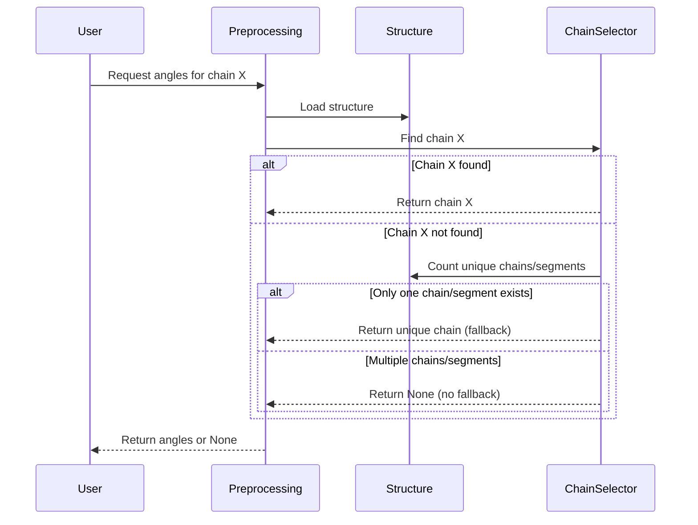

# Pull Request #69: Fix test issues in angle extraction module

## Status
- State: MERGED
- Created: 2025-05-04
- Updated: 2025-05-04
- Closed: 2025-05-04
- Merged: 2025-05-04

## Changes
- Additions: 2682
- Deletions: 3
- Changed Files: 11

## Author
- Name: ImmortalDemonGod
- Login: ImmortalDemonGod
- Bot: No

## Assignees
- None

## Description
## Changes

1. Fixed hardcoded absolute path in `test_compute_ground_truth_angles.py` by replacing it with a relative path constructed using the existing `dataset_dir` variable.

2. Improved test robustness in `test_extract_angles.py` by using specific exception types (`RuntimeError`) instead of generic `Exception` in the `pytest.raises()` statement.

## Benefits

- The code is now more portable and will work correctly in different environments, including CI/CD pipelines.
- Tests are more robust by checking for specific exceptions rather than catching any exception type.

These changes address the issues raised in PR #67 comments.

---
Pull Request opened by [Augment Code](https://www.augmentcode.com/) with guidance from the PR author

## Summary by CodeRabbit

- **Bug Fixes**
  - Improved chain selection fallback in angle extraction to handle cases where the requested chain is missing but only one chain is present.
  - Enhanced tests to verify correct fallback behavior based on the number of chains in input structures.
  - Fixed temporary file handling for improved resource management in data processing and tests.
  - Updated test script path resolution for better portability.
  - Removed unused imports in test files.
- **New Features**
  - Enabled loading of angular information by default in configuration settings.

## Comments

### Comment by coderabbitai
- Created: 2025-05-04
- Author Association: NONE

> [!NOTE]
> Currently processing new changes in this PR. This may take a few minutes, please wait...
> 
> 
> 📥 Commits
> 
> Reviewing files that changed from the base of the PR and between 794be900534b0f64b80a264c81c8e87ad071ccf3 and 864e5c74f9a48145b45eee8705dad7f194622a14.
> 
> 
> 
> 
> 📒 Files selected for processing (3)
> 
> * `scripts/test_utils/batch_test_generator.py` (1 hunks)
> * `tests/common/test_batch_test_generator.py` (1 hunks)
> * `tests/common/test_remove_logger_lines.py` (1 hunks)
> 
> 
> 
> ```ascii
>  ____________________________________________
> 
>  --------------------------------------------
>   \
>    \   (\__/)
>        (•ㅅ•)
>        / 　 づ
> ```

## Walkthrough

This update introduces several improvements and refinements across configuration, dataset preprocessing, and testing modules. The configuration file now enables angular data loading. In the preprocessing logic, the chain selection mechanism is enhanced to allow a fallback to a unique chain if the requested chain is missing but only one exists. Temporary file handling is refactored for better resource management in both preprocessing and test scripts. Test cases are updated to reflect the new fallback logic and to improve path handling, while unused imports are removed for code cleanliness.

## Changes

| File(s)                                                                                  | Change Summary                                                                                                                                                                                                                                 |
|------------------------------------------------------------------------------------------|------------------------------------------------------------------------------------------------------------------------------------------------------------------------------------------------------------------------------------------------|
| rna_predict/conf/data/default.yaml                                                       | Changed `load_ang` parameter from `false` to `true` to enable angular data loading.                                                                                                                     |
| rna_predict/dataset/preprocessing/angles.py                                              | Cleaned up imports, improved temporary file handling with a context manager, and enhanced `_select_chain_with_fallback` to select a unique chain if the requested one is missing but only one exists.                                         |
| rna_predict/dataset/tmp_tests/test_angle_extraction_perf.py                              | Refactored temporary file creation to use a context manager for better resource management.                                                                                                             |
| rna_predict/dataset/tmp_tests/test_compute_ground_truth_angles.py                        | Updated script path assignment to use a dynamically constructed absolute path instead of a hardcoded one.                                                                                               |
| rna_predict/dataset/tmp_tests/test_dssr_installation.py                                 | Removed an unused import of `pytest`.                                                                                                                                                                   |
| rna_predict/dataset/tmp_tests/test_extract_angles.py                                     | Enhanced test to check fallback behavior when a chain is missing, distinguishing between single and multiple chain scenarios; broadened exception types in `_convert_cif_to_pdb_invalid` test.           |

## Sequence Diagram(s)



## Poem

> In the warren of code, a new path’s been found,  
> Where chains once were missing, a fallback’s around!  
> With angles now loaded, and temp files kept neat,  
> The tests check each corner, ensuring no defeat.  
> Hop, hop, hooray, for a structure robust—  
> This code-bunny’s proud, in improvements we trust! 🐇✨


✨ Finishing Touches

- [ ]  📝 Docstrings were successfully generated. (🔄  Check again to generate docstrings again)


---


🪧 Tips

### Chat

There are 3 ways to chat with [CodeRabbit](https://coderabbit.ai?utm_source=oss&utm_medium=github&utm_campaign=ImmortalDemonGod/RNA_PREDICT&utm_content=69):

- Review comments: Directly reply to a review comment made by CodeRabbit. Example:
  - `I pushed a fix in commit , please review it.`
  - `Generate unit testing code for this file.`
  - `Open a follow-up GitHub issue for this discussion.`
- Files and specific lines of code (under the "Files changed" tab): Tag `@coderabbitai` in a new review comment at the desired location with your query. Examples:
  - `@coderabbitai generate unit testing code for this file.`
  -	`@coderabbitai modularize this function.`
- PR comments: Tag `@coderabbitai` in a new PR comment to ask questions about the PR branch. For the best results, please provide a very specific query, as very limited context is provided in this mode. Examples:
  - `@coderabbitai gather interesting stats about this repository and render them as a table. Additionally, render a pie chart showing the language distribution in the codebase.`
  - `@coderabbitai read src/utils.ts and generate unit testing code.`
  - `@coderabbitai read the files in the src/scheduler package and generate a class diagram using mermaid and a README in the markdown format.`
  - `@coderabbitai help me debug CodeRabbit configuration file.`

### Support

Need help? Create a ticket on our [support page](https://www.coderabbit.ai/contact-us/support) for assistance with any issues or questions.

Note: Be mindful of the bot's finite context window. It's strongly recommended to break down tasks such as reading entire modules into smaller chunks. For a focused discussion, use review comments to chat about specific files and their changes, instead of using the PR comments.

### CodeRabbit Commands (Invoked using PR comments)

- `@coderabbitai pause` to pause the reviews on a PR.
- `@coderabbitai resume` to resume the paused reviews.
- `@coderabbitai review` to trigger an incremental review. This is useful when automatic reviews are disabled for the repository.
- `@coderabbitai full review` to do a full review from scratch and review all the files again.
- `@coderabbitai summary` to regenerate the summary of the PR.
- `@coderabbitai generate docstrings` to [generate docstrings](https://docs.coderabbit.ai/finishing-touches/docstrings) for this PR.
- `@coderabbitai generate sequence diagram` to generate a sequence diagram of the changes in this PR.
- `@coderabbitai resolve` resolve all the CodeRabbit review comments.
- `@coderabbitai configuration` to show the current CodeRabbit configuration for the repository.
- `@coderabbitai help` to get help.

### Other keywords and placeholders

- Add `@coderabbitai ignore` anywhere in the PR description to prevent this PR from being reviewed.
- Add `@coderabbitai summary` to generate the high-level summary at a specific location in the PR description.
- Add `@coderabbitai` anywhere in the PR title to generate the title automatically.

### CodeRabbit Configuration File (`.coderabbit.yaml`)

- You can programmatically configure CodeRabbit by adding a `.coderabbit.yaml` file to the root of your repository.
- Please see the [configuration documentation](https://docs.coderabbit.ai/guides/configure-coderabbit) for more information.
- If your editor has YAML language server enabled, you can add the path at the top of this file to enable auto-completion and validation: `# yaml-language-server: $schema=https://coderabbit.ai/integrations/schema.v2.json`

### Documentation and Community

- Visit our [Documentation](https://docs.coderabbit.ai) for detailed information on how to use CodeRabbit.
- Join our [Discord Community](http://discord.gg/coderabbit) to get help, request features, and share feedback.
- Follow us on [X/Twitter](https://twitter.com/coderabbitai) for updates and announcements.

---

### Comment by coderabbitai
- Created: 2025-05-04
- Author Association: NONE

> [!NOTE]
> Generated docstrings for this pull request at https://github.com/ImmortalDemonGod/RNA_PREDICT/pull/70

---
