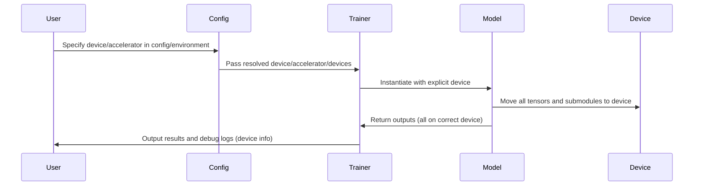

# Pull Request #71: Feat/phase1 step2 direct angle loss

## Status
- State: MERGED
- Created: 2025-05-05
- Updated: 2025-05-06
- Closed: 2025-05-06
- Merged: 2025-05-06

## Changes
- Additions: 1703
- Deletions: 667
- Changed Files: 61

## Author
- Name: ImmortalDemonGod
- Login: ImmortalDemonGod
- Bot: No

## Assignees
- None

## Description
### Summary :memo:
_Write an overview about it._

### Details
_Describe more what you did on changes._
1. (...)
2. (...)

### Bugfixes :bug: (delete if dind't have any)
-

### Checks
- [ ] Closed #798
- [ ] Tested Changes
- [ ] Stakeholder Approval

## Summary by CodeRabbit

- **New Features**
  - Added support for extracting comprehensive RNA torsion angles with canonical and extended sets, including CLI and config options.
  - Enabled explicit device specification and hardware accelerator control across training, inference, and configuration.

- **Bug Fixes**
  - Fixed device placement inconsistencies for tensors, models, and data loaders to prevent mismatch errors.
  - Enhanced error handling for device configs and sequence extraction robustness.

- **Documentation**
  - Improved and expanded docstrings in core modules and tests for better clarity.

- **Tests**
  - Extended coverage for device management, angle extraction variants, and integration workflows.
  - Added tests for device parameter enforcement and hardware compatibility.

- **Refactor**
  - Unified device management and debug logging throughout pipeline stages and models.
  - Updated data batching, loading, and model initialization to require explicit device assignment.

- **Chores**
  - Added detailed debug logging and tracing for device resolution and runtime behavior.
  - Updated configs to support dynamic device assignment via environment variables.

## Comments

### Comment by coderabbitai
- Created: 2025-05-05
- Author Association: NONE

## Walkthrough

This update introduces explicit, consistent device management across the RNA prediction pipeline. All model and utility classes now require device specification via configuration, removing implicit CPU defaults. Debug logging is enhanced throughout, with detailed device placement diagnostics and improved error handling. Configuration files and tests are updated to ensure explicit device propagation and robust handling of device-related edge cases.

## Changes

| File(s) | Change Summary |
|---------|---------------|
| `rna_predict/conf/config_schema.py`, `rna_predict/conf/default.yaml`, `rna_predict/conf/model/*.yaml` | Device and hardware accelerator settings are now explicitly configurable via environment variables and config fields. Device references in model configs are interpolated for dynamic assignment. |
| `rna_predict/dataset/collate.py`, `rna_predict/dataset/dataset_loader.py`, `rna_predict/dataset/loader.py` | Collate and dataset loaders now require explicit device arguments, propagate device through all tensor operations, and add extensive debug logging for device placement. |
| `rna_predict/dataset/preprocessing/angle_utils.py`, `rna_predict/dataset/preprocessing/angles.py`, `rna_predict/dataset/preprocessing/compute_ground_truth_angles.py` | Angle extraction utilities now support both canonical and extended ("full") angle sets, with new helper functions and CLI options. Debugging and docstrings are improved. |
| `rna_predict/dataset/tmp_tests/*`, `tests/stageB/*`, `tests/stageC/*`, `tests/stageD/*`, `tests/test_*` | Test suites are updated to require explicit device configuration, add parameterized tests for angle extraction, and provide more robust and descriptive docstrings. |
| `rna_predict/pipeline/stageA/adjacency/RFold_code.py`, `rna_predict/pipeline/stageA/adjacency/rfold_predictor.py` | RFold and StageA predictors now enforce explicit device specification, remove device autodetection, and add debug logging for device resolution and tensor placement. |
| `rna_predict/pipeline/stageB/main.py`, `rna_predict/pipeline/stageB/pairwise/dummy_pairformer.py`, `rna_predict/pipeline/stageB/pairwise/pairformer_wrapper.py`, `rna_predict/pipeline/stageB/torsion/dummy_torsion_model.py`, `rna_predict/pipeline/stageB/torsion/torsion_bert_predictor.py`, `rna_predict/pipeline/stageB/torsion/torsionbert_inference.py` | StageB modules now require explicit device config, propagate device to all submodules, and enhance device-related logging and error handling. Dummy models enforce device arguments. |
| `rna_predict/pipeline/stageC/stage_c_reconstruction.py` | StageCReconstruction now takes a config object, extracting device and debug flags from config, with snoop tracing added for debugging. |
| `rna_predict/pipeline/stageD/diffusion/*`, `rna_predict/pipeline/stageD/stage_d_utils/feature_utils.py`, `rna_predict/pipeline/stageD/run_stageD.py` | Diffusion pipeline components now require explicit device specification, add device consistency checks, and include debug logging for device propagation. |
| `rna_predict/pipeline/merger/simple_latent_merger.py` | SimpleLatentMerger accepts an optional device argument, centralizing device placement. |
| `rna_predict/predict.py` | Adds snoop tracing and debug logging for sequence inputs in the main prediction pipeline. |
| `rna_predict/training/rna_lightning_module.py`, `rna_predict/training/train.py` | Lightning module and training script enforce explicit device config, add detailed device logging, and replace loss with direct torsion angle MSE loss. DataLoader adapts worker count for MPS devices. |
| `scripts/test_utils/batch_test_generator.py`, `tests/common/test_batch_test_generator.py`, `tests/test_config.py` | Test utilities and config tests improve docstrings, add environment variable override tests, and enhance robustness of config path resolution. |
| `tests/integration/test_pipeline_dimensions.py`, `tests/test_args_namespace.py`, `tests/test_rfold_model.py`, `tests/test_rfold_model_fix.py`, `tests/test_rna_lightning_module.py`, `tests/test_debug_logging.py` | Tests are updated to include explicit device parameters in configs and test setups, ensuring compatibility with new device handling. |

## Sequence Diagram(s)

## Poem

> 🐇  
> In the warren of code, device rules now reign,  
> No more CPU lurking as fallback in vain.  
> Every tensor, each model, knows where it should be—  
> CUDA, MPS, or humble old CPU.  
> Debug logs abound, tracing each leap,  
> Now rabbits and models both restfully sleep!  
> 🌱

✨ Finishing Touches

- [ ]  📝 Generate Docstrings

---

🪧 Tips

### Chat

There are 3 ways to chat with [CodeRabbit](https://coderabbit.ai?utm_source=oss&utm_medium=github&utm_campaign=ImmortalDemonGod/RNA_PREDICT&utm_content=71):

- Review comments: Directly reply to a review comment made by CodeRabbit. Example:
  - `I pushed a fix in commit , please review it.`
  - `Generate unit testing code for this file.`
  - `Open a follow-up GitHub issue for this discussion.`
- Files and specific lines of code (under the "Files changed" tab): Tag `@coderabbitai` in a new review comment at the desired location with your query. Examples:
  - `@coderabbitai generate unit testing code for this file.`
  -	`@coderabbitai modularize this function.`
- PR comments: Tag `@coderabbitai` in a new PR comment to ask questions about the PR branch. For the best results, please provide a very specific query, as very limited context is provided in this mode. Examples:
  - `@coderabbitai gather interesting stats about this repository and render them as a table. Additionally, render a pie chart showing the language distribution in the codebase.`
  - `@coderabbitai read src/utils.ts and generate unit testing code.`
  - `@coderabbitai read the files in the src/scheduler package and generate a class diagram using mermaid and a README in the markdown format.`
  - `@coderabbitai help me debug CodeRabbit configuration file.`

### Support

Need help? Create a ticket on our [support page](https://www.coderabbit.ai/contact-us/support) for assistance with any issues or questions.

Note: Be mindful of the bot's finite context window. It's strongly recommended to break down tasks such as reading entire modules into smaller chunks. For a focused discussion, use review comments to chat about specific files and their changes, instead of using the PR comments.

### CodeRabbit Commands (Invoked using PR comments)

- `@coderabbitai pause` to pause the reviews on a PR.
- `@coderabbitai resume` to resume the paused reviews.
- `@coderabbitai review` to trigger an incremental review. This is useful when automatic reviews are disabled for the repository.
- `@coderabbitai full review` to do a full review from scratch and review all the files again.
- `@coderabbitai summary` to regenerate the summary of the PR.
- `@coderabbitai generate docstrings` to [generate docstrings](https://docs.coderabbit.ai/finishing-touches/docstrings) for this PR.
- `@coderabbitai generate sequence diagram` to generate a sequence diagram of the changes in this PR.
- `@coderabbitai resolve` resolve all the CodeRabbit review comments.
- `@coderabbitai configuration` to show the current CodeRabbit configuration for the repository.
- `@coderabbitai help` to get help.

### Other keywords and placeholders

- Add `@coderabbitai ignore` anywhere in the PR description to prevent this PR from being reviewed.
- Add `@coderabbitai summary` to generate the high-level summary at a specific location in the PR description.
- Add `@coderabbitai` anywhere in the PR title to generate the title automatically.

### CodeRabbit Configuration File (`.coderabbit.yaml`)

- You can programmatically configure CodeRabbit by adding a `.coderabbit.yaml` file to the root of your repository.
- Please see the [configuration documentation](https://docs.coderabbit.ai/guides/configure-coderabbit) for more information.
- If your editor has YAML language server enabled, you can add the path at the top of this file to enable auto-completion and validation: `# yaml-language-server: $schema=https://coderabbit.ai/integrations/schema.v2.json`

### Documentation and Community

- Visit our [Documentation](https://docs.coderabbit.ai) for detailed information on how to use CodeRabbit.
- Join our [Discord Community](http://discord.gg/coderabbit) to get help, request features, and share feedback.
- Follow us on [X/Twitter](https://twitter.com/coderabbitai) for updates and announcements.

---

### Comment by coderabbitai
- Created: 2025-05-05
- Author Association: NONE

> [!NOTE]
> Generated docstrings for this pull request at https://github.com/ImmortalDemonGod/RNA_PREDICT/pull/72

---
