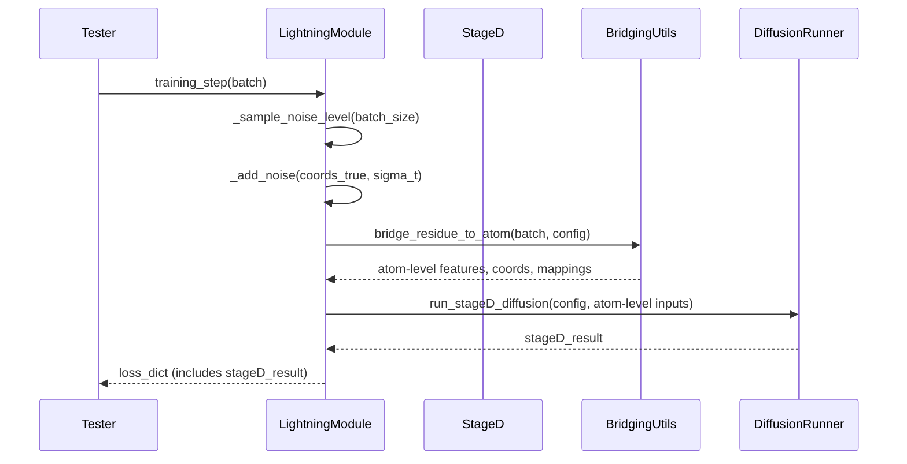

# Pull Request #73: Feat/phase2-step1-stageD-input-preparation

## Status
- State: MERGED
- Created: 2025-05-08
- Updated: 2025-05-12
- Closed: 2025-05-12
- Merged: 2025-05-12

## Changes
- Additions: 10619
- Deletions: 12111
- Changed Files: 119

## Author
- Name: ImmortalDemonGod
- Login: ImmortalDemonGod
- Bot: No

## Assignees
- None

## Description
### Summary :memo:
_Write an overview about it._

### Details
_Describe more what you did on changes._
1. (...)
2. (...)

### Bugfixes :bug: (delete if dind't have any)
-

### Checks
- [ ] Closed #798
- [ ] Tested Changes
- [ ] Stakeholder Approval

## Summary by CodeRabbit

- **New Features**
  - Added TensorBoard dependency for enhanced training visualization.
  - Introduced `CombinedLoader` for robust DataLoader iteration with explicit usage enforcement.
  - Added detailed debug logging and tracing across multiple pipeline components.
  - Added utilities for noise sampling and noise addition supporting Stage D training.
  - Introduced stub configuration class for diffusion manager integration.
  - Added shared features configuration for consistent feature dimension parameters.
  - Enhanced residue-to-atom bridging with stricter validation and improved mapping logic.

- **Bug Fixes**
  - Improved device and configuration handling with robust fallback, error messages, and conditional debug logging.
  - Fixed tensor dimension checks and safe handling to avoid attribute misuse and crashes.
  - Enforced mandatory configuration fields, removing unsafe defaults.
  - Corrected expansion and mapping logic in residue-to-atom bridging with added assertions.

- **Refactor**
  - Standardized and nested model configuration structures under `model.stageB` and other stages for clarity.
  - Replaced print debug outputs with conditional structured logging controlled by debug flags.
  - Consolidated device management and dummy mode logic in model wrappers.
  - Enhanced error handling and logging around diffusion runner and bridging steps.
  - Updated test infrastructure to use realistic configs and direct Lightning trainer runs without mocks.

- **Style**
  - Added detailed debug prints and logging for tensor shapes, device placement, and gradient tracking.
  - Updated function signatures to reflect enhanced logging and feature handling.
  - Disabled or removed `snoop` decorators from production code to reduce overhead.

- **Tests**
  - Rewrote and expanded integration and unit tests with realistic configurations, synthetic batches, and direct Lightning trainer execution.
  - Updated test configurations to match new nested config structures, adding explicit device and debug logging parameters.
  - Added tests verifying legacy config rejection, gradient flow, and noise helper correctness.
  - Improved test robustness by skipping unsupported device tests and creating minimal synthetic datasets.

- **Chores**
  - Added and updated dependencies, including TensorBoard and Hydra-core.
  - Improved configuration validation by making certain fields mandatory and supporting nested configs.
  - Added shared configuration inclusion in defaults for consistent parameter sourcing.
  - Enhanced memory management and logging during diffusion sampling steps.
  - Improved logging setup and replaced f-string error messages with plain strings for consistency.

## Comments

### Comment by coderabbitai
- Created: 2025-05-08
- Author Association: NONE

> [!CAUTION]
> ## Review failed
> 
> The pull request is closed.

## Walkthrough

This update introduces extensive debugging, logging, and runtime introspection throughout the RNA prediction pipeline, especially in bridging, diffusion, and transformer modules. It standardizes configuration structures, enforces stricter validation, and adds new and enhanced tests for gradient flow, noise handling, and integration. Several functions and classes gain conditional debug logging, improved device management, and detailed error handling. The configuration hierarchy is made more consistent, and new dependencies and test scripts are added.

## Changes

| File(s) / Path(s) | Change Summary |
|-------------------|---------------|
| `pyproject.toml` | Added dependency: `tensorboard>=2.19.0`. |
| `rna_predict/dataset/dataset_loader.py` | Relaxed device assertion for CPU in test contexts; added `os` import for environment check. |
| `rna_predict/dataset/loader.py`, `rna_predict/dataset/preprocessing/angles.py` | Added `snoop` import and decorated key methods/functions for tracing. |
| `rna_predict/dataset/tmp_tests/debug_adaptive_layernorm.py` | Removed explicit `AdaptiveLayerNorm` import and class usage; replaced with placeholders. |
| `rna_predict/dataset/tmp_tests/test_adaptive_layernorm.py` | Enabled gradient tracking on test tensors; added gradient check and main guard. |
| `rna_predict/dataset/tmp_tests/test_dataset_loader_error.py` | Added disabled test for CombinedLoader error handling; marked as obsolete with comments. |
| `rna_predict/dataset/tmp_tests/test_gradient_flow_through_stageD.py` | Added parameterized test to verify gradient flow through Stage D with dummy config and tensors. |
| `rna_predict/dataset/tmp_tests/test_layernorm_grad.py` | Added standalone script to test gradient computation through biasless LayerNorm. |
| `rna_predict/dataset/tmp_tests/test_lightning_combined_loader_error.py` | Added test for Lightning Trainer error when CombinedLoader is not properly initialized. |
| `rna_predict/dataset/tmp_tests/test_noise_helpers.py` | Added tests for noise sampling and addition; includes Hydra fixture and edge case checks. |
| `rna_predict/dataset/tmp_tests/test_rna_lightning_module.py` | Added tests for RNALightningModule training logic, noise/bridging, and gradient flow; includes dummy batch/output helpers. |
| `rna_predict/pipeline/stageA/adjacency/rfold_predictor.py` | Moved `super().__init__()` to start of constructor; gated device debug logs on `debug_logging` flag. |
| `rna_predict/pipeline/stageA/input_embedding/current/primitives/adaptive_layer_norm.py` | Added optional `c_s_layernorm` param; set `elementwise_affine=True, bias=False` for LayerNorms; added debug prints and assertions. |
| `rna_predict/pipeline/stageA/input_embedding/current/transformer/attention.py`, `.../diffusion.py`, `.../transition.py` | Added detailed debug print statements at key points in forward passes for tensor properties and gradient status. |
| `rna_predict/pipeline/stageA/input_embedding/current/transformer/encoder_components/feature_processing.py` | Added explicit checks and debug prints for feature presence and tensor shapes. |
| `rna_predict/pipeline/stageA/input_embedding/current/transformer/encoder_components/forward_logic.py` | Fixed dimension checks to call `dim()` method; improved robustness in broadcasting logic. |
| `rna_predict/pipeline/stageA/input_embedding/current/utils/coordinate_utils.py` | Refactored broadcasting and aggregation logic; removed special test cases; added robust fallback and debug logging. |
| `rna_predict/pipeline/stageB/main.py` | Enhanced debug logging configuration; centralized and gated debug output; improved config flag detection and device handling. |
| `rna_predict/pipeline/stageB/pairwise/pairformer_wrapper.py` | Improved config extraction, device resolution, and added detailed debug/info logs; test-aware error handling. |
| `rna_predict/pipeline/stageB/torsion/torsion_bert_predictor.py` | Refactored config/device handling and logging; added debug_logging flag; consolidated dummy mode logic. |
| `rna_predict/pipeline/stageB/torsion/torsionbert_inference.py` | Replaced print statements with logger calls gated by `debug_logging`; added `debug_logging` attribute to model classes. |
| `rna_predict/pipeline/stageC/stage_c_reconstruction.py`, `rna_predict/predict.py` | Disabled or commented out `@snoop` decorators on key functions/methods. |
| `rna__atom_bridge.py` | Enhanced debugging, expanded config path handling, improved residue-to-atom expansion and mapping, added assertions. |
| `rna__utils.py` | Changed `extract_sequence` to always return a list of characters; updated docstring and type annotations. |
| `rna__conditioning.py` | Replaced print with logging in debug mode; checks for instance `debug_logging` attribute; expanded accepted types for unified_latent. |
| `rna__module.py` | Added debug-logging propagation and print statements for scatter operation in `f_forward`; simplified token dim mismatch handling. |
| `rna_predict/pipeline/stageD/diffusion/generator.py` | Added explicit garbage collection and memory logging calls around diffusion steps; replaced prints with logger calls. |
| `rna_predict/pipeline/stageD/diffusion/protenix_diffusion_manager.py` | Added stub `DiffusionManagerConfig` class; made debug logging conditional in init; passed `max_atoms` from config. |
| `rna_predict/pipeline/stageD/diffusion/run_stageD_unified.py` | Added comprehensive logging, error handling, and defensive checks for config validation and bridging. |
| `rna_predict/pipeline/stageD/stage_d_utils/config_utils.py` | Made `atoms_per_residue` a required config field; removed default fallback. |
| `rna_predict/pipeline/stageD/stage_d_utils/feature_utils.py` | Added debug logging for atom metadata validation. |
| `rna_predict/training/rna_lightning_module.py` | Added debug_logging flag; replaced print with logger; added noise sampling/addition methods; integrated Stage D training logic and bridging; added dummy val/test dataloaders. |
| `rna_predict/training/train.py` | Added structured logging; replaced print with logger; ensured checkpoint directory creation; improved DataLoader debug output and error handling. |
| `rna_predict/utils/scatter_utils.py` | Added debug prints for `scatter_mean`; replaced loop fallback with vectorized fallback using `scatter_add`. |
| `tests/common/test_dataset_loader.py` | Dynamically selects device; skips test if only CPU is available. |
| `tests/integration/test_lightning_trainer.py` | Completely rewritten: uses minimal real config, synthetic batch, runs Lightning fast_dev_run, writes model summary. |
| `tests/stageA/unit/adjacency/test_RFold_code.py` | Added `device = 'cpu'` attribute to mock args for RFoldModel; marked flaky test as skipped. |
| `tests/stageB/test_combined_torsion_pairformer.py`, `tests/stageB/test_hydra_integration.py`, `tests/stageB/torsion/test_torsionbert_predictor_hypothesis.py`, `tests/stageB/torsion/test_verify_torsionbert_predictor.py` | Standardized configs to nested `model.stageB.torsion_bert` and `model.stageB.pairformer` structures; updated device and debug flags; updated test logic to match new config paths. |
| `tests/stageB/test_main_comprehensive.py` | Added detailed `pairformer` and `stageC` configs with explicit device and parameters. |
| `tests/test_rna_lightning_module.py` | Expanded and refined test config with new parameters and debug flags across stages. |
| `rna_predict/conf/data/default.yaml` | Replaced hardcoded feature sizes with references to shared config variables. |
| `rna_predict/conf/default.yaml` | Added `shared: features` to defaults list. |
| `rna_predict/conf/model/stageD_diffusion.yaml` | Replaced hardcoded feature sizes with references to shared config variables. |
| `rna_predict/conf/shared/features.yaml` | Added new shared config file defining feature dimension parameters. |
| `rna_predict/dataset/combined_loader.py` | Added `CombinedLoader` class wrapping PyTorch DataLoader with explicit iterator enforcement and error on misuse. |
| `rna_predict/dataset/preprocessing/compute_ground_truth_angles.py` | Added Hydra config loading for chain ID; parsed structure files to list chain IDs; used config chain ID over CLI. |
| `rna_predict/dataset/tmp_tests/test_train_with_angle_supervision.py` | Refactored test to create minimal synthetic dataset; invoked training via subprocess with minimal config; simplified assertions. |
| `rna_predict/pipeline/stageD/diffusion/context_objects.py` | Added `max_atoms` field and post-init logging to `FeaturePreparationContext`; added memory logging in `EmbeddingContext.get_z_trunk`. |
| `rna_predict/pipeline/stageD/run_stageD.py` | Added memory logging after diffusion step; replaced dummy output for tests with differentiable dummy tensor; added logging setup function. |
| `rna_predict/pipeline/stageD/stage_d_utils/bridging_utils.py` | Added warning log when synthetic `atom_to_token_idx` mapping fallback is used. |
| `rna_predict/pipeline/stageD/stage_d_utils/output_utils.py` | Removed coordinate padding/truncation before diffusion; added debug log of original coordinate shape. |
| `rna_predict/utils/angle_loss.py` | Added new `angle_loss` function computing masked MSE loss between predicted and target angles. |

## Sequence Diagram(s)

## Possibly related PRs

- [ImmortalDemonGod/RNA_PREDICT#46](https://github.com/ImmortalDemonGod/RNA_PREDICT/pull/46): Introduces the original residue-to-atom bridging mechanism now further integrated and debugged in this PR.
- [ImmortalDemonGod/RNA_PREDICT#67](https://github.com/ImmortalDemonGod/RNA_PREDICT/pull/67): Implements the `_load_angles` logic, which this PR now instruments with snoop tracing for debugging.
- [ImmortalDemonGod/RNA_PREDICT#62](https://github.com/ImmortalDemonGod/RNA_PREDICT/pull/62): Extensive integration and enhancement of Hydra configuration management across the RNA_PREDICT pipeline, related to config handling improvements in this PR.

## Poem

> In the warren of code where the tensors hop,  
> Debug logs now bloom from bottom to top.  
> With snoop and with logging, the bugs we outfox,  
> Bridging residues to atoms, no need for a box.  
> Tests now abound, gradients flow free—  
> A carrot for progress, from rabbit to thee!  
> 🥕🐇

> [!TIP]
> 
> ⚡️ Faster reviews with caching
> 
> - CodeRabbit now supports caching for code and dependencies, helping speed up reviews. This means quicker feedback, reduced wait times, and a smoother review experience overall. Cached data is encrypted and stored securely. This feature will be automatically enabled for all accounts on May 16th. To opt out, configure `Review - Disable Cache` at either the organization or repository level. If you prefer to disable all data retention across your organization, simply turn off the `Data Retention` setting under your Organization Settings.
> 
> Enjoy the performance boost—your workflow just got faster.
> 
> 

✨ Finishing Touches

- [ ]  📝 Generate Docstrings

---

🪧 Tips

### Chat

There are 3 ways to chat with [CodeRabbit](https://coderabbit.ai?utm_source=oss&utm_medium=github&utm_campaign=ImmortalDemonGod/RNA_PREDICT&utm_content=73):

- Review comments: Directly reply to a review comment made by CodeRabbit. Example:
  - `I pushed a fix in commit , please review it.`
  - `Generate unit testing code for this file.`
  - `Open a follow-up GitHub issue for this discussion.`
- Files and specific lines of code (under the "Files changed" tab): Tag `@coderabbitai` in a new review comment at the desired location with your query. Examples:
  - `@coderabbitai generate unit testing code for this file.`
  -	`@coderabbitai modularize this function.`
- PR comments: Tag `@coderabbitai` in a new PR comment to ask questions about the PR branch. For the best results, please provide a very specific query, as very limited context is provided in this mode. Examples:
  - `@coderabbitai gather interesting stats about this repository and render them as a table. Additionally, render a pie chart showing the language distribution in the codebase.`
  - `@coderabbitai read src/utils.ts and generate unit testing code.`
  - `@coderabbitai read the files in the src/scheduler package and generate a class diagram using mermaid and a README in the markdown format.`
  - `@coderabbitai help me debug CodeRabbit configuration file.`

### Support

Need help? Create a ticket on our [support page](https://www.coderabbit.ai/contact-us/support) for assistance with any issues or questions.

Note: Be mindful of the bot's finite context window. It's strongly recommended to break down tasks such as reading entire modules into smaller chunks. For a focused discussion, use review comments to chat about specific files and their changes, instead of using the PR comments.

### CodeRabbit Commands (Invoked using PR comments)

- `@coderabbitai pause` to pause the reviews on a PR.
- `@coderabbitai resume` to resume the paused reviews.
- `@coderabbitai review` to trigger an incremental review. This is useful when automatic reviews are disabled for the repository.
- `@coderabbitai full review` to do a full review from scratch and review all the files again.
- `@coderabbitai summary` to regenerate the summary of the PR.
- `@coderabbitai generate docstrings` to [generate docstrings](https://docs.coderabbit.ai/finishing-touches/docstrings) for this PR.
- `@coderabbitai generate sequence diagram` to generate a sequence diagram of the changes in this PR.
- `@coderabbitai resolve` resolve all the CodeRabbit review comments.
- `@coderabbitai configuration` to show the current CodeRabbit configuration for the repository.
- `@coderabbitai help` to get help.

### Other keywords and placeholders

- Add `@coderabbitai ignore` anywhere in the PR description to prevent this PR from being reviewed.
- Add `@coderabbitai summary` to generate the high-level summary at a specific location in the PR description.
- Add `@coderabbitai` anywhere in the PR title to generate the title automatically.

### CodeRabbit Configuration File (`.coderabbit.yaml`)

- You can programmatically configure CodeRabbit by adding a `.coderabbit.yaml` file to the root of your repository.
- Please see the [configuration documentation](https://docs.coderabbit.ai/guides/configure-coderabbit) for more information.
- If your editor has YAML language server enabled, you can add the path at the top of this file to enable auto-completion and validation: `# yaml-language-server: $schema=https://coderabbit.ai/integrations/schema.v2.json`

### Documentation and Community

- Visit our [Documentation](https://docs.coderabbit.ai) for detailed information on how to use CodeRabbit.
- Join our [Discord Community](http://discord.gg/coderabbit) to get help, request features, and share feedback.
- Follow us on [X/Twitter](https://twitter.com/coderabbitai) for updates and announcements.

---
